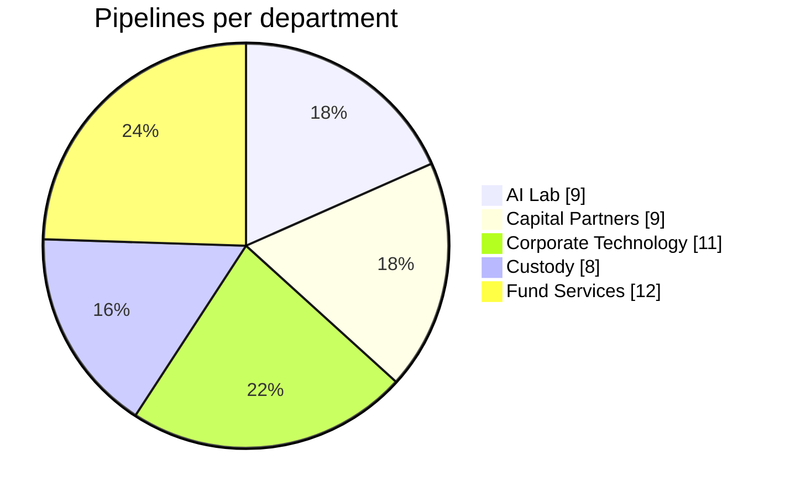
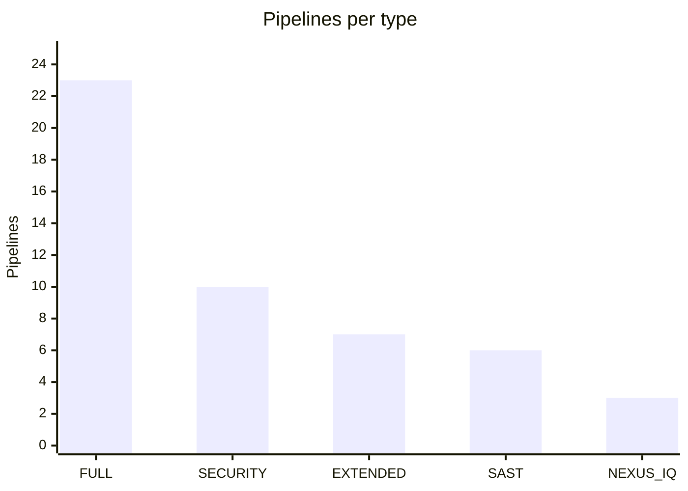
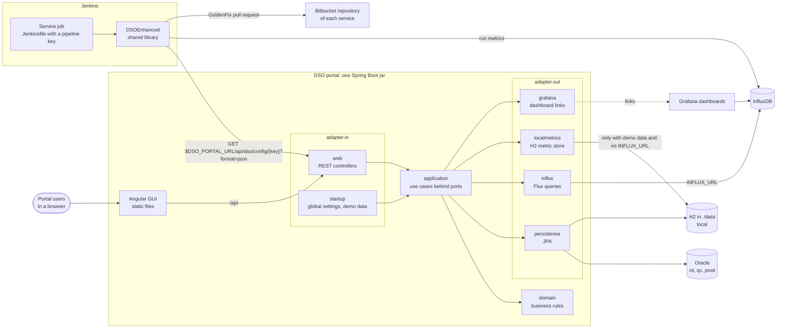
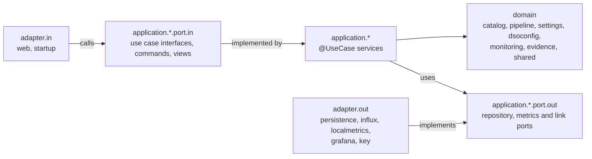
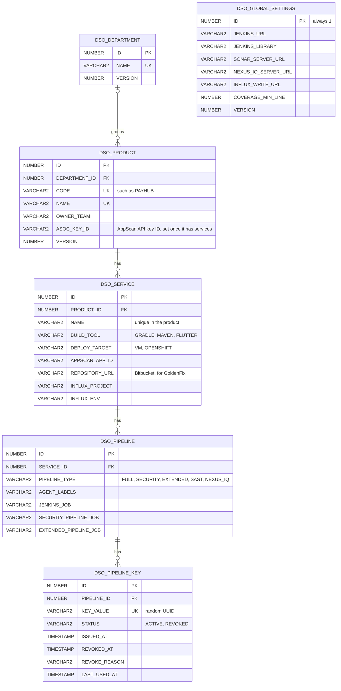
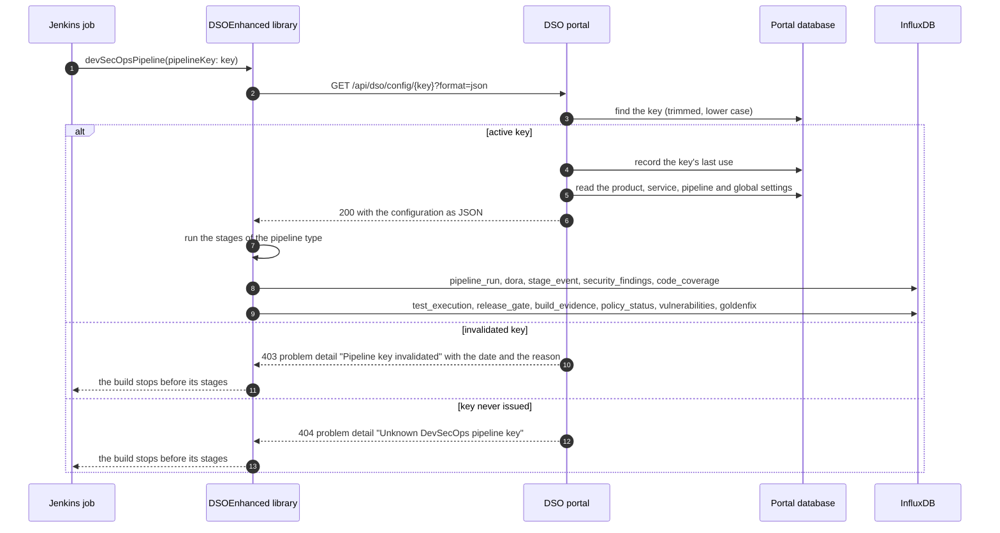

# BBH DevSecOps Management Portal

A web portal to onboard products to DevSecOps and to watch their pipelines. Its header has two menus:
**DevSecOps Management** and **Beadle**, where new features land.

DevSecOps Management:

- **Pipelines**: the DevSecOps pipelines of your department. Pick your department (the browser remembers it, and Beadle
  uses the same choice) and see its pipelines in a table you can sort and filter in the header: service, product,
  pipeline type, Jenkins job, key (by its hint, or Invalidated), the status of the last run and when it ran. **Edit**
  in a row changes the pipeline's agents, Jenkins job and description. A row opens the page of its pipeline: the key
  (shown on request and copied whole), when it was issued and last fetched, its settings, the Jenkinsfile ready to
  copy and the last five runs, with links to its Jenkins job, its metrics and its product. Its **More** menu shows the
  configuration the library receives and the key history, replaces or invalidates the key and deletes the pipeline;
  an invalidated key is regenerated with one button.
- **Self-service**: a step-by-step wizard for app owners who do not know DevSecOps. It sets up a new product or
  changes one already in the portal: choose the department and the product, then the pipeline, in this order: SAST
  (Static Application Security Tests) - HCL AppScan, OSA (Open Source Analysis) (NexusIQ with Golden Fix and Golden Pull
  Request), Security (Unit Tests, NexusIQ, SAST, SonarQube) or Full (Static Security (unit test, NexusIQ, SAST,
  SonarQube) + Extended (lower test region deployment, regression, performance, smoke, DAST, *higher test region
  deployment)); for a product in the portal the step shows which pipelines each service has today and how many
  services already have each one. Then the services: add new ones (name, AppScan application, Gradle or Maven, virtual
  machines or OpenShift; for OSA also the Nexus IQ application and the Bitbucket repository of each service), change
  the existing ones (including their build tool and where they run) or remove them.
  The review lists what is added, changed and removed, which services gain the pipeline and which pipelines a removal
  deletes; the last step lists what to do next in order, with the Jenkinsfile of each service ready to copy.
  The build tool and where a service runs start from the library defaults; the OpenShift project, the Nexus IQ
  application, the Bitbucket repository, the build and the Jenkins job of each pipeline are filled in from the
  service template, and every value can be changed. Everything else comes from the BBH library defaults and can be
  fine-tuned in DevSecOps Admin.
- **Pipeline Monitoring**: the DORA metrics and daily runs of all pipelines over the last 30 days, a chart of pipeline
  status per department, every product with the status of its pipelines grouped by department, and per pipeline its
  DORA metrics, daily activity, latest runs, the Jenkins job and your DSOEnhanced Grafana dashboard, all read from the
  InfluxDB the pipelines write to.
- **Change Evidence**: a read-only view of a product for ProTech change requests: per pipeline the unit, smoke,
  regression and performance tests, the SAST, DAST, SonarQube and Nexus IQ results, the golden pull request GoldenFix
  raised, the release gate and the Jenkins build that produced them, with its artifact version and the portal
  configuration it ran with.
- **Admin**, for the portal administrator, in four tabs:
  - **Departments**: add, rename and delete departments (only an empty one can be deleted), each with its products,
    services and DevSecOps pipelines, and a chart of the active and invalidated pipelines of every department. The
    five BBH departments (AI Lab, Capital Partners, Corporate Technology, Custody and Fund Services) come with the
    database.
  - **Products**: add a product with all of its services and every setting the DevSecOps library
    ([DSOEnhanced](https://github.com/mateuszmatan/DSOEnhanced)) reads from `config.yaml` today, edit or delete it.
    Every new service gets a full pipeline with its own key; keys can be invalidated, regenerated and linked to a
    Jenkins job, and each service names the Bitbucket repository where DSOEnhanced raises its GoldenFix pull
    requests. A product saved before departments existed shows as "Not in a department" until it is edited, which
    means choosing one.
  - **Service template**: what a new service and a new pipeline get, in Self-service and in the Add service and Add
    pipeline forms: the Jenkins agents and job of a pipeline, the Gradle and Maven tasks and artifacts, the Nexus IQ
    application, scan patterns and Bitbucket repository, and the OpenShift project, image registry and health check.
    The names take the placeholders `{CODE}` (the product code), `{code}` (the same in lower case) and `{service}`,
    and the job also `{type}` (full, security, extended, sast or nexusiq), so `DevSecOps/{CODE}/{service}-{type}`
    names the full pipeline of `backend-api` in CERT `DevSecOps/CERT/backend-api-full`. An example shows what a
    service gets while you type. The pipeline the portal creates for a new service takes its agents and job from it.
  - **Library defaults**: the DSOEnhanced library defaults every pipeline shares and no service can override. They
    replace the library's `defaults.yaml`.

Beadle, in three tabs:

- **Changes**: the ProTech (BBH's ServiceNow) changes of your department. Pick your department (the browser remembers
  it) and see its changes in a table you can sort and filter in the header: change number, product, FixVersion, the
  ProTech workflow state, the installation window, the short description, the number of change tasks and when it was
  raised. Opening a change reads it from ProTech first, so what was changed there (texts, schedule, fields, CTASKs and
  their states) shows at once, with its change number, approval (Not Yet Requested in Draft, Requested in the
  approval stages, Approved from Implementation on), who opened it, its state and the workflow progress through
  Draft, Business Approval, Primary Approval, Secondary Approval, CTask approval, Escalated approval, Implementation
  and Closed. An open change can be edited by its department, in the same sections as New Change: the update is
  published to ProTech at once, and Beadle checks and shows whether ProTech applied it.
  See [ProTech production changes](#protech-production-changes).
- **New Change**: the guided wizard that raises a change for a production release. Choose the department and the
  product: the product's change template fills in every step, and each value can be changed for this change. A
  magnifier next to a person, the department, the assignment group, the release, the affected CI, the incident, the
  problem and the affected clients searches ProTech (see [Lookups](#lookups)) and fills the field with the value
  picked (affected clients adds it to the list); every such field also takes free text. The steps:
  1. **Generic request data**, in two columns: the change number (given by ProTech when the change is raised),
     approval (Not Yet Requested), Opened By (the signed-in user) and state (Draft), all read-only; then requested
     for, requested by, department, assignment group, category, assigned to, type, release, affected CI, incident,
     direct business service, problem, risk, affected clients and users affected. Requested for, requested by and
     assigned to default to the signed-in user and the department to the product's department; the direct business
     service comes with the CI picked from the search and the risk is worked out from the risk assessment, so neither
     is typed.
  2. **Jira**: type the FixVersion of the release (the known versions are offered, unreleased first); its epics are
     listed, and choosing epics loads their stories. The short description and the description are written from the
     choice and stay editable.
  3. **Approval and Notification**: business approver, L1 approver and L2 approver.
  4. **Schedule**: the installation start and its hours, the post-install validation start and its hours, the first
     use and, when the change has downtime, the downtime start and its hours, which default to the installation
     window. The template's start time and hours are the defaults, on the release date of the FixVersion while it is
     ahead, otherwise on the next day.
  5. **Planning**: test summary, implementation plan, validation plan, backout plan and first use plan.
  6. **Privileged access**: how many privileged accounts (none to seven), each with its person and its account name.
  7. **Risk assessment**: nine questions in two columns, each answered from a fixed list; the template's answers are
     the defaults.
  8. **Secure coding**: the secure coding ticket number.
  9. **Review**: every value with the change tasks, which stay editable; raising it creates one change (CHG) with its
     change tasks (CTASK) in ProTech.
- **Admin**, in two tabs: **Departments** (the same departments as DevSecOps Admin, without the pipeline counts) and
  **Products**: every product by department with the state of its change template. Add a product with its name,
  code, department, owner team and contact e-mail (no DevSecOps setting); on its page change its name, department,
  owner team and contact e-mail, delete it with its change template while it has no services in DevSecOps
  Management, and keep its **change template**: the ProTech fields in the sections and order of New Change, and the
  default change tasks of its changes (see [ProTech production changes](#protech-production-changes)).

Departments and products are one data set: both Admin areas edit the same records. Services stay in DevSecOps
Management, where the pipelines need them; ProTech has no such thing, so Beadle neither shows nor uses them. Beadle
reads and changes only a product's own details (`/api/products/{id}/details`), so a change there keeps the services,
the AppScan account and the pipelines as they are, and a product that still has services is deleted in DevSecOps
Management only. A product needs its AppScan API key once it has services: the product editor of DevSecOps Admin and
Self-service ask for it when a product added in Beadle has none yet.

No `config.yaml` remains in the product repositories. The portal-integrated library reads each pipeline's
configuration from the portal by its key, so a service needs only the generic Jenkinsfile and its pipeline key:

```groovy
@Library('DevSecOpsJenkinsLibrary') _

devSecOpsPipeline(pipelineKey: '6f1c2d3e-0000-4abc-9def-123456789abc')
```

A run that builds several services of one product passes the keys of their pipelines of that type, the primary service
first; the product page in DevSecOps Admin offers this Jenkinsfile in the menu of a pipeline, and the page of a
pipeline in Pipelines shows its own. Extended pipelines join only when they name
the same security pipeline, since the run reads the security run state of the primary's only:

```groovy
devSecOpsPipeline(pipelineKeys: ['6f1c2d3e-0000-4abc-9def-123456789abc', 'a1b2c3d4-0000-4abc-9def-123456789abc'])
```

During the cutover, pin the portal-integrated library version (for example `DevSecOpsJenkinsLibrary@main`)
in the shared library of Admin > Library defaults (`platform.jenkinsLibrary`, the name the generated Jenkinsfiles load) and in
the `@Library` line of every migrated job, until every job carries a key.

## Running it locally

Needs Java 17, and Node.js 20.19 or a later 20.x with npm 10.8 or a later 10.x on the `PATH` (the build calls `npm` and
`npx` from there, or the paths in `npm.executable` and `npx.executable` when those files exist). The Gradle wrapper
downloads Gradle 8.14 from the BBH Nexus.

```bash
./gradlew :backend:bootJar
java -jar backend/build/libs/dso-portal-0.1.0-SNAPSHOT.jar
```

Open http://localhost:8080, or http://localhost:8080/self-service for the Self-service wizard. Without a profile
the portal runs with `local`: an embedded H2 database in Oracle mode in `./data`, with demo products on the first
start. Every feature works on it. `./gradlew :backend:bootRun` does the same without building the jar (the database
then lives in `backend/data`).

To see metrics, point the portal at your InfluxDB and Grafana:

```bash
INFLUX_URL=https://influx.example.com INFLUX_TOKEN=... \
GRAFANA_DASHBOARD_URL=https://grafana.example.com/d/adzfc54123/devsecops-pipeline-long \
GRAFANA_SECURITY_DASHBOARD_URL=https://grafana.example.com/d/ad2trcm/devsecops-pipeline-security \
  java -jar backend/build/libs/dso-portal-0.1.0-SNAPSHOT.jar
```

The dashboards are the ones DSOEnhanced ships (`grafana/` in that repository); the portal opens them with the
service's `project` variable and the selected time range. Security, SAST and Nexus IQ GoldenFix pipelines open the
security dashboard, the other pipelines the pipeline dashboard. Grafana must let portal users view them.

A second Grafana instance takes `GRAFANA_2_DASHBOARD_URL` and `GRAFANA_2_SECURITY_DASHBOARD_URL`, and each
instance is named with `GRAFANA_NAME` and `GRAFANA_2_NAME` (`Grafana` and `Grafana 2` when unset). The pipeline
page then embeds the dashboard of every instance that has one for the pipeline, under the instance's name, so two
Grafanas can share the dashboards, or one can hold the pipeline dashboard and the other the security one. An
instance without the security dashboard shows its pipeline dashboard for security pipelines too, and an instance
without the pipeline dashboard shows nothing for the other pipelines:

```bash
GRAFANA_NAME="Grafana test" GRAFANA_DASHBOARD_URL=https://grafana-test.example.com/d/adzfc54123/devsecops-pipeline-long \
GRAFANA_2_NAME="Grafana prod" GRAFANA_2_DASHBOARD_URL=https://grafana.example.com/d/adzfc54123/devsecops-pipeline-long \
GRAFANA_2_SECURITY_DASHBOARD_URL=https://grafana.example.com/d/ad2trcm/devsecops-pipeline-security \
  java -jar backend/build/libs/dso-portal-0.1.0-SNAPSHOT.jar
```

## Demo data

The `local` profile sets `dso.demo-data=true` (`DSO_DEMO_DATA`). On the first start it fills the H2 database in
`./data` with ten products in the five departments: 23 services and 49 pipelines, 47 of them with an active key. The
loader (`adapter/in/startup/DemoDataLoader.java`) adds the demo products that are missing and does nothing once the
database holds all of them or any product of its own; it also sets the Jenkins URL of the library defaults to
`https://jenkins.bbh.com` when none is set, so that job and build links work. `rd`, `qc` and `prod` (Oracle) get only
the five departments, from Liquibase, and the BBH library defaults; no product, service, pipeline or metric is
seeded there. Every demo product without a saved change template gets a filled one
(`adapter/in/startup/DemoChangeProfiles.java`), picked with a fixed seed per product code: the assignment group of
its owner team, its direct business service from the configuration item search, approvers, schedule defaults,
planning texts, a risk assessment from the fixed answers, affected clients and users affected that match the
answers, downtime for the products whose risk is High, a secure coding ticket, privileged access for Payments Hub,
and two or three default change tasks ("Deploy <product> to production", "Run the database scripts of <product>"
for the products whose risk is Moderate or High, "Validate <product> in production"). Requested for, requested by,
the department and assigned to stay empty, so each change takes the signed-in user and the product's department.
The demo Jira knows two released and one or two unreleased FixVersions per project, for example `PAYHUB 2.4`.
At start-up twelve demo changes are raised in the demo ProTech (`adapter/out/servicenow/DemoProTechChanges.java`),
skipping those of a product that already has a change, so a database from an earlier version gets them too when the
portal is updated. They are spread over the departments and their products, with real demo epics and stories, the
installation window as the downtime window of the products with downtime, and past raise times and schedules chosen
so that on a new database three are Closed (installed last week), three are in Implementation (one of them
installing right now), one is in Escalated approval (raised 30 minutes ago, installed in 20 hours) and five were
raised one to nine minutes ago and move from Draft to CTask approval while the portal runs. One of them carries an
applied update and one an update ProTech did not apply (a schedule change while its installation ran).

| Department | Product (code) | Services | Build and deploy | Pipelines |
|------------|----------------|----------|------------------|-----------|
| AI Lab | DocSense (`DOCSENSE`) | `extraction-api`<br>`review-ui` | Gradle, OpenShift<br>Gradle, VMs | FULL, SECURITY, EXTENDED, NEXUS_IQ<br>FULL, SAST |
| AI Lab | Advisor Assistant (`ADVISORAI`) | `assistant-api`<br>`content-indexer` | Maven, OpenShift<br>Gradle, OpenShift | FULL, SECURITY<br>FULL |
| Capital Partners | DealFlow (`DEALFLOW`) | `deals-web`<br>`deals-api` | Gradle, VMs<br>Maven, OpenShift | FULL<br>FULL, SECURITY, EXTENDED |
| Capital Partners | LP Portal (`LPPORTAL`) | `portal-web`<br>`statements`<br>`lp-mobile` | Gradle, OpenShift<br>Maven, OpenShift<br>Flutter | FULL<br>FULL, SAST<br>FULL, SAST |
| Corporate Technology | Access Hub (`ACCESSHUB`) | `requests-ui`<br>`workflow` | Gradle, VMs<br>Maven, OpenShift | FULL<br>FULL, SECURITY, NEXUS_IQ |
| Corporate Technology | CertScanner (`CERTSCANNER`) | `gui`<br>`backend-api` | Gradle, VMs<br>Maven, OpenShift | FULL, SECURITY, EXTENDED, SAST<br>FULL, SECURITY, EXTENDED |
| Custody | Safekeeping Ledger (`SAFEKEEP`) | `positions-api`<br>`recon-batch` | Maven, OpenShift<br>Gradle, VMs | FULL, SECURITY, EXTENDED<br>FULL, SAST (key revoked) |
| Custody | Corporate Actions (`CORPACT`) | `events-api`<br>`elections-ui` | Gradle, OpenShift<br>Gradle, VMs | FULL, SECURITY<br>FULL |
| Fund Services | Payments Hub (`PAYHUB`) | `gateway`<br>`ledger`<br>`notifications`<br>`mobile-app` | Maven, OpenShift<br>Gradle, VMs<br>Gradle, VMs<br>Flutter | FULL, SECURITY, EXTENDED, NEXUS_IQ<br>FULL<br>FULL<br>FULL, SAST (key revoked) |
| Fund Services | NAV Calculator (`NAVCALC`) | `pricing-engine`<br>`nav-api` | Maven, OpenShift<br>Gradle, OpenShift | FULL, SECURITY<br>FULL, EXTENDED |

Build and deploy: *Gradle, VMs* is a Gradle build deployed to virtual machines with UrbanCode Deploy and the SSH
deployment script; *Gradle, OpenShift* and *Maven, OpenShift* build with Gradle or Maven and deploy a container to the
RD and QC OpenShift projects; *Flutter* is a Flutter mobile app built as an APK. Every service has a full pipeline
plus the types listed after `FULL`. The keys of two SAST pipelines are revoked, so those pipelines show as disabled:
Payments Hub `mobile-app` ("Mobile app moved to the new mobile platform pipeline") and Safekeeping Ledger `recon-batch`
("Reconciliation moved to the mainframe scheduler"). Three services with a Nexus IQ application and a Bitbucket
repository also have a Nexus IQ GoldenFix pipeline (`NEXUS_IQ`): DocSense `extraction-api`, Access Hub `workflow` and
Payments Hub `gateway`. Jenkins jobs are named `DevSecOps/<CODE>/<service>-<type>`, for example
`DevSecOps/PAYHUB/gateway-full` and `DevSecOps/PAYHUB/gateway-nexusiq`; CertScanner's full, security and extended
pipelines share the jobs `DevSecOps/CertScanner-pipeline`, `-security-pipeline` and `-extended-pipeline` and the
metrics project `CertScanner` for both services.





### Generated run history

With demo data on and `INFLUX_URL` empty, the portal reads its metrics from the table `DSO_METRIC_POINT` in H2
instead of InfluxDB (changeset `013-local-metrics`, `dbms:h2`, so the table never exists on Oracle). When that table
is empty at start-up, the portal records a random run history of the last 120 days for every pipeline, generated with
a fixed seed per pipeline, so monitoring, DORA metrics and change evidence show data out of the box and
`/api/monitoring/status` reports the metrics store as configured and reachable. Pipelines that share a metrics tag,
a type and a Jenkins job (CertScanner's two services) share one history, so 49 pipelines get 46 histories. The
history is recorded once and does not grow while the portal runs; delete `./data` (`backend/data` with `bootRun`) to
start over with a new catalogue and a history that ends at the new start.

| Type | Runs per day, on average | Duration | Stages |
|------|--------------------------|----------|--------|
| `FULL` | 1.4 | 45 to 95 minutes | Checkout, Build, Unit Tests, SonarQube, AppScan SAST, Nexus IQ, Publish Artifact, Deploy RD, Smoke Tests, Regression Tests, Deploy QC, Release Gate |
| `SECURITY` | 0.7 | 20 to 45 minutes | Checkout, Build, Unit Tests, AppScan SAST, Nexus IQ, SonarQube, AppScan DAST, Release Gate |
| `EXTENDED` | 0.4 | 70 to 130 minutes | Checkout, Read Security Run, Deploy RD, Smoke Tests, Regression Tests, Performance Tests, AppScan DAST, Deploy QC, Release Gate |
| `SAST` | 0.9 | 6 to 18 minutes | Checkout, Build, AppScan SAST, Release Gate |
| `NEXUS_IQ` | 0.8 | 5 to 15 minutes | Checkout, Build, Nexus IQ, Release Gate |

- Runs start in working hours, 06:00 to 21:00 UTC. A run that would start on a Saturday or Sunday moves to Monday
  four times out of five, so most runs fall on weekdays.
- Each pipeline gets a health between 75% and 97%, the chance that a run succeeds. After a failed run the next one
  succeeds only 45% of the time, so failures tend to repeat. A run that does not succeed fails (half of them), is
  unstable with one warning check (four in ten) or is aborted (one in ten). A `NEXUS_IQ` run that would succeed is
  unstable six times in ten instead, its Nexus IQ stage warning about a policy violation, so the demo shows golden
  pull requests.
- Runs build `develop` (55%), `main` (15%), a `feature/` branch (22%) or a `release/` branch (8%). A run is a
  deployment when it reached Deploy RD on a branch other than `feature/`, so only full and extended pipelines deploy;
  a deployment whose run failed is a change failure. Each pipeline has its own typical lead time of 2 to 47 hours.
- Every run writes `pipeline_run` and `dora` points. The last two runs of each pipeline also carry the full evidence:
  `stage_event` per stage; per service `build_evidence`, and `test_execution`, `code_coverage` and
  `security_findings` for the stages the run reached; and `policy_status`, `vulnerabilities` and `release_gate`.
- When the Nexus IQ stage of such a run warns (a policy violation), in any pipeline type that runs Nexus IQ, every
  service also gets a `goldenfix` point: GoldenFix raised the golden pull request (`PR_CREATED`) in the service's
  Bitbucket repository, numbered after the build and titled `GoldenFix-<yyyyMMddHHmm>` after the run's end, with two
  to four upgrades offered and at most one left unresolved; a service without a repository gets `NOT_CONFIGURED` and
  no pull request, as in the library. These values follow from the run itself, so the rest of the history is the
  same as without them.
- The history of a pipeline whose key is revoked ends nine days before the first start.

## Profiles and configuration

| Profile | Where | Database |
|---------|-------|----------|
| `local` (default) | a developer's machine | embedded H2 in `./data`, demo data |
| `rd` | the lower test environment | Oracle |
| `qc` | UAT | Oracle |
| `prod` | production | Oracle |

| Variable | Default | Meaning |
|----------|---------|---------|
| `DB_URL`, `DB_USERNAME`, `DB_PASSWORD` | H2 with `local`; required with `rd`, `qc`, `prod` | database of the active profile |
| `DB_POOL_SIZE` | 5, 10, 20 in `rd`, `qc`, `prod` | Oracle connection pool size |
| `PORT` | `8080` | HTTP port |
| `INFLUX_URL`, `INFLUX_TOKEN` | empty | your InfluxDB; empty switches the monitoring off, except with demo data, which then reads the local metrics store (see [Demo data](#demo-data)) |
| `INFLUX_ORG`, `INFLUX_BUCKET` | `DevSecOps`, `DORA-metrics` | where DSOEnhanced writes its metrics |
| `GRAFANA_DASHBOARD_URL` | empty | link to the DSOEnhanced pipeline dashboard; empty leaves this instance without one, and without any link the pipeline page shows no dashboard |
| `GRAFANA_SECURITY_DASHBOARD_URL` | empty | link to the security dashboard for `SECURITY`, `SAST` and `NEXUS_IQ` pipelines; empty uses the pipeline dashboard |
| `GRAFANA_NAME` | `Grafana` | the name of that Grafana instance on the pipeline page |
| `GRAFANA_2_DASHBOARD_URL`, `GRAFANA_2_SECURITY_DASHBOARD_URL`, `GRAFANA_2_NAME` | empty, empty, `Grafana 2` | the same for a second Grafana instance; both empty links leave it out |
| `DSO_DEMO_DATA` | `true` with `local` | create the demo products when the database holds no other product, and without `INFLUX_URL` a run history; see [Demo data](#demo-data) |
| `DSO_SIGNED_IN_USER` | `Mateusz Matan` | the user Beadle names as the signed-in user (`GET /api/me`, Opened By of a new change and the default requester and assignee) until BBH single sign-on exists |

```bash
SPRING_PROFILES_ACTIVE=qc DB_URL=jdbc:oracle:thin:@//<host>:1521/<service> DB_USERNAME=DSO_PORTAL DB_PASSWORD=... \
  java -jar backend/build/libs/dso-portal-0.1.0-SNAPSHOT.jar
```

Liquibase creates and updates the schema at start-up, on Oracle and on H2. The BBH tool servers and everything else
pipelines share are stored in the database and edited in Admin > Library defaults. Secrets never reach the portal:
services name Jenkins credentials IDs, and the generated configuration carries only those IDs.

## Build

The build follows the BBH Gradle layout: one root `build.gradle` and two modules, `frontend` and `backend`.

| File | Holds |
|------|-------|
| `settings.gradle` | the BBH Nexus repositories for plugins and dependencies, and the two modules |
| `build.gradle` | the plugins, Java 17, SonarQube, the npm tasks of `frontend` and how `backend` packages and publishes the jar |
| `backend/build.gradle`, `frontend/build.gradle` | the dependencies and the test suites of each module |
| `gradle.properties` | the BBH npm registry, proxy and CA file, and the `npm`/`npx` paths on Windows |
| `gradle/libs.versions.toml` | the plugin and library versions |
| `gradle/wrapper/gradle-wrapper.properties` | Gradle 8.14 from the BBH Nexus |
| `frontend/.npmrc` | the BBH npm registry and the Node.js and npm versions of `package.json` as hard requirements |

The frontend tasks call npm from the `PATH`, with the `npm.*` properties of `gradle.properties` as npm settings:
`installNpmCIDeps` (`npm ci`), `installDesignSystem` (`npm install --no-save` of the BBH Design System packages
`@v6/v6-themes`, `@v6/v6-table` and `@v6/v6-icons`, inside BBH only), `buildAngular` (`npx ng build
--configuration=production` into `frontend/dist`), `testAngular` (`npx ng test --watch=false --coverage`, Vitest on
jsdom, so it needs no browser) and `copyToBackend` (`frontend/dist` into `backend/src/main/resources/static`, which
git ignores). `bootJar`, `bootRun` and the backend smoke test depend on `copyToBackend`; `-PskipFrontend` builds the
backend without the GUI.

The BBH Design System packages live only in the BBH npm registry, so `package.json` does not list them and `npm ci`
works anywhere. `-PdesignSystem.packages="@v6/v6-themes@21 @v6/v6-table @v6/v6-icons"` names other versions. AG Grid
Enterprise needs BBH's licence key at build time: `-PagGridLicenseKey=...` or the `AG_GRID_LICENSE_KEY` environment
variable; without it the grids work and print AG Grid's licence notice in the browser console.

```bash
./gradlew :backend:bootJar          # the jar with the GUI inside
./gradlew check                     # every suite of both modules, see Tests
./gradlew sonar                     # SonarQube at tools.bbh.com/sonar, project DSOMgmtPortal, token in SONAR_AUTH_TOKEN
./gradlew publish                   # the jar to the BBH Nexus (bbhNexusUsername and bbhNexusPassword as Gradle properties)
./gradlew :backend:bootJar -PartifactVersion=1.4.0
```

`publish` sends a `-SNAPSHOT` version to `nexus.snapshotsUrl` and any other to `nexus.releasesUrl`, both in
`gradle.properties`.

### Outside the BBH network

The BBH Nexus, the npm registry and the `njproxy` proxy only answer inside BBH. Elsewhere, put these lines into
`~/.gradle/gradle.properties` (they win over the project's `gradle.properties`):

```properties
bbhNetwork=false
systemProp.http.proxyHost=
systemProp.https.proxyHost=
```

`bbhNetwork=false` takes plugins from the Gradle Plugin Portal and dependencies from Maven Central, and runs npm
against `https://registry.npmjs.org/` (`npm.publicRegistry` names another) without the BBH proxy and CA file. It
also skips `installDesignSystem` and builds the GUI with the `public` configuration, which swaps the BBH Design System
styles and icons for a navy Bootstrap theme with the same layout. The
empty proxy hosts switch `njproxy` off; set them to your own proxy if you have one. The wrapper's Gradle download also
sits on the BBH Nexus, so run a local Gradle 8.14 (`gradle check`, for example from SDKMAN) until the wrapper has
it in `~/.gradle/wrapper/dists`. Running npm by hand outside BBH needs `--registry=https://registry.npmjs.org/`.

## OpenShift

The portal ships as one container image (UBI 9 with Java 17, any non-root UID). `Dockerfile` and the Kustomize
manifests for `rd`, `qc` and `prod` are described in [deploy/openshift/README.md](deploy/openshift/README.md).

## Architecture

```
frontend/   Angular 21, Bootstrap 5.3, BBH Design System, AG Grid, Highcharts: views, shared components, API services
backend/    Spring Boot 4.1, Java 17, Spring Data JPA, Liquibase; serves the API and the built GUI
deploy/     the OpenShift manifests
examples/   Jenkinsfiles, API calls, a rendered configuration and GUI screenshots; see Examples below
```

The portal is one Spring Boot jar that serves the API and the built Angular GUI. Jenkins jobs never reach its
database: the DSOEnhanced library asks the portal for each pipeline's configuration by key, writes its run metrics to
InfluxDB, and raises its GoldenFix pull requests in the service's Bitbucket repository. The portal reads those metrics
back for the monitoring and change evidence pages and links the DSOEnhanced Grafana dashboards.



The backend (`backend/src/main/java/com/bbh/itss/dso/portal`) is hexagonal:

| Package | Holds |
|---------|-------|
| `domain` | plain Java: products, services and their settings, pipelines and keys, the global settings, the rendered configuration, DORA metrics, change evidence and ProTech production changes with their sync and update rules; every business rule lives here |
| `application` | the use cases behind ports, per area (`catalog`, `change`, `dsoconfig`, `evidence`, `monitoring`, `pipeline`, `settings`), each with its `port.in` and `port.out` packages; `@UseCase` classes become transactional beans, without Spring in the code |
| `adapter.in` | Spring MVC controllers with the request and response records (`web`), and the start-up tasks (`startup`) |
| `adapter.out` | JPA entities and Spring Data repositories (`persistence`), the InfluxDB client (`influx`), the Grafana links (`grafana`), the local metrics store of the demo data (`localmetrics`), the demo Jira and ProTech adapters and the demo changes (`jira`, `servicenow`) and the key generator (`key`) |
| `config` | the wiring of use cases and transactions |



ArchUnit tests keep the domain and the use cases free of Spring, JPA and Jackson, and keep the adapters apart: the
domain depends only on the JDK, Lombok and Apache Commons, the application only on the domain and the same libraries,
`adapter.in` never on `adapter.out` or a `port.out`, `adapter.out` never on `adapter.in`, and every `@UseCase` class
implements a `port.in` interface. The key generator's port, `KeyGenerator`, lives in `domain.pipeline`.

### Code conventions

- Static imports wherever the name stays clear on its own: enum constants, constants, `Collectors`, `Comparator`,
  `requireNonNull`, the Commons helpers. Generic names such as `List.of`, `Optional.empty` or `Product.restore` keep
  their class.
- Apache Commons (`StringUtils`, `ObjectUtils`, `BooleanUtils`, `CollectionUtils`, `ListUtils`) instead of repeated
  null and empty checks, for example `trimToNull(name)`, `getIfNull(tests, TestSettings.DEFAULTS)` or
  `List.copyOf(emptyIfNull(jobs))`.
- Lombok instead of hand-written constructors, accessors, builders and loggers. `backend/lombok.config` makes accessors
  fluent (`id()`, like the records), and utility classes use `@NoArgsConstructor(access = PRIVATE)` rather than
  `@UtilityClass`, whose members javac cannot import statically. Entities never get `@Data` or `@EqualsAndHashCode`.
- No exception classes that only add a name. The code throws JDK exceptions with a message, and
  `ApiExceptionHandler` maps them: `NoSuchElementException` is 404, `IllegalStateException` is 409 (a clash with
  stored data or an outdated `version`), `SecurityException` is 403 (an invalidated pipeline key, or a Beadle change
  of another department) and
  `InvalidRequestException`, the one portal exception because it carries the failing fields, is 400. An
  `UncheckedIOException` from the metrics store becomes the metrics error of the page; anything else is a 500 and
  is logged, so a programming error throws `IllegalArgumentException` (for example `Validate.isTrue`), never
  `IllegalStateException`.
- Groovy specs and fixtures use Groovy's own `?.`, `?:` and the records' builders instead of Commons and Lombok, and
  keep GDK names such as `min` or `round` qualified.
- No comments in the code.

### Data model

Liquibase creates the tables from `backend/src/main/resources/db/changelog/oracle`, one SQL file per change; most
changesets run on Oracle and on H2, a few on one of them only. The main tables and a few of their columns:



A service has at most one pipeline of each type, and a pipeline at most one `ACTIVE` key; revoked keys stay as its
key history. `DEPARTMENT_ID` is empty only for a product saved before departments existed, and `ASOC_KEY_ID` only for
a product without services, such as one added in Beadle Admin (`018-beadle-products.sql`). The service settings that
repeat live in child tables of `DSO_SERVICE` (`DSO_SERVICE_TEST_JOB`, `DSO_SERVICE_SSH_TARGET`,
`DSO_SERVICE_OPENSHIFT_TARGET`, `DSO_UCD_APPLICATION` with `DSO_UCD_COMPONENT`, `DSO_SERVICE_NEXUS_IQ_APP`), and the
scanners' severity limits in `DSO_GLOBAL_SEVERITY_LIMIT`. The service template of Admin > Service template is the one
row of `DSO_SERVICE_TEMPLATE`, written on its first save. `DSO_METRIC_POINT` exists on H2 only; see
[Demo data](#demo-data).

Beadle keeps a product's change template in `DSO_CHANGE_PROFILE` with its privileged users and its default change
tasks (`DSO_CHANGE_PROFILE_PRIVILEGED_USER`, `DSO_CHANGE_PROFILE_TASK`), and every raised change in
`DSO_PRODUCTION_CHANGE`: its department (`DEPARTMENT_ID`, emptied when the department is deleted), the ProTech state
(`STATE`), when it was last read from ProTech (`SYNCED_AT`) and the last update from Beadle (`UPDATE_STATUS`,
`UPDATE_REQUESTED_AT`, `UPDATE_DEPARTMENT`, `UPDATE_FIELDS`, `UPDATE_MESSAGE`, `UPDATE_CHECKED_AT`), with its change
tasks and their states (`DSO_PRODUCTION_CHANGE_TASK`, `TASK_NUMBER` empty until ProTech created the task), the stages
it entered (`DSO_PRODUCTION_CHANGE_STAGE`) and its privileged users (`DSO_PRODUCTION_CHANGE_PRIVILEGED_USER`).
Both tables hold the request fields of the wizard (`REQUESTED_FOR`, `REQUESTED_BY`, `REQUEST_DEPARTMENT`,
`ASSIGNED_TO`, `DIRECT_BUSINESS_SERVICE`, `USERS_AFFECTED`, `SECURE_CODING_TICKET`) and the nine risk answers as
their list values (`RISK_*`); the computed risk is not stored. A change also keeps who opened it (`OPENED_BY`) and
its downtime window (`DOWNTIME_START`, `DOWNTIME_END`).

## DevSecOps integration

| Request | Answer |
|---------|--------|
| `GET /api/dso/config/{key}` | 200 with the pipeline's `config.yaml` (`?format=json` for JSON), recording the key's last use; 403 with the reason once the key is invalidated; 404 for a key never issued |
| `GET /api/pipelines/{id}/config` | the same configuration for the portal UI, without recording a use |
| `GET /api/products/{id}/config` | every service of a product as one `config.yaml` |
| `GET /api/settings/config` | the part of every configuration that comes from the global settings |

Every key the library reads per service is a setting of the service. A service may name its own Nexus IQ server and
credentials, SonarQube server, InfluxDB write URL and credentials, and AppScan secret (a Secret text credentials ID);
left empty, the configuration carries the global setting or, for the AppScan secret, the product's. One Nexus IQ
application is written as `tools.nexusIq.application: <name>`; several are written as a map of applications, each
entry with its scan patterns, stage and the effective server and credentials.

### How the library reads its configuration

The library reads each pipeline's configuration from this portal over HTTPS, with one
`GET /api/dso/config/<key>?format=json` per key, sent with `curl` from a Jenkins agent before the pipeline starts.
The portal renders the configuration from its database at that moment and records the key's last use. Jenkins needs
only the portal's address, the global environment variable `DSO_PORTAL_URL` (for example
`https://dso-portal.apps.bbh.com`); it holds no database account, no credentials and no driver, and only the portal
reaches its database.



The key is the only check. Whoever holds a key reads the configuration of that one pipeline, which names Jenkins
credentials IDs and no passwords, much as anyone who could read a product repository could read its `config.yaml`.
Keys are random UUIDs, the API lists none of them by this request, and an invalidated key is refused with 403 at once.
When the portal moves behind BBH SSO, `/api/dso/config/**` stays outside the sign-in.

A pipeline's metrics are matched by the InfluxDB tags the library writes: `project` (the service's metrics project
plus the pipeline type suffix: none for full, `security`, `extended`, `sast`, `nexusiq`) and `env`.

Several services may share one metrics project and env. Under a shared tag a `pipeline_run` belongs to the pipeline
whose Jenkins job (or a branch of it) recorded it in the `job` field; a pipeline without a Jenkins job shows no run,
and a run of one job building several services belongs to each of them. DORA metrics and the Grafana dashboard stay
per tag. Concurrent runs under one tag can still mix the points the library writes without a `module` tag.

### Nexus IQ GoldenFix pipeline

A Nexus IQ GoldenFix pipeline (`NEXUS_IQ`, Jenkinsfile `devSecOpsNexusIqGoldenFixPipeline(pipelineKey: '<key>')`,
job `DevSecOps/<CODE>/<service>-nexusiq`) runs three stages: *Monitor source changes (download sources)*, *Build
artifact* and *Dependencies scan (Nexus IQ)*. When the scan reports a policy violation, GoldenFix applies the upgrades
Nexus IQ offers and raises the golden pull request `GoldenFix-<yyyyMMddHHmm>` in the service's Bitbucket repository.
The pipeline deploys nothing and runs no other scan.

Its configuration (`pipeline.type: nexusiq`) carries the service's settings like any other pipeline and links no
security or extended job. The service needs:

- its Nexus IQ applications, with scan patterns that match the artifacts the build produces;
- its Bitbucket repository and credentials ID (`scm.bitbucket`); without a repository the library records
  `NOT_CONFIGURED` and raises no pull request;
- GoldenFix switched on, by the service's own switch or by the GoldenFix defaults of the global settings;
- an AppScan application, which every service keeps whatever its pipelines.

Its metrics carry the project suffix `nexusiq` and its Grafana links open the security dashboard of every instance. Change Evidence
shows its Nexus IQ results and, per service, the `goldenfix` point: the status, the upgrades offered, applied and left
unresolved, and the link and title of the pull request. Liquibase changeset `015-nexus-iq-pipeline` adds `NEXUS_IQ`
to the pipeline type check of `DSO_PIPELINE`; its rollback first deletes the Nexus IQ GoldenFix pipelines with their
keys.

### Change evidence

The Change Evidence page reads the points of a pipeline's latest run, per service (`module` tag):

- `test_execution` with `suite=unit` gives the unit test row (total, passed, failed, skipped, duration); the smoke,
  regression and performance rows come from the suites the remote test jobs record, and the status of the stage that
  ran a suite wins over its counts;
- `build_evidence` gives the artifact version, the SonarQube quality gate (`OK`, `WARN`, `ERROR`; `NONE` reads as not
  recorded), the SAST, DAST, Nexus IQ and SonarQube report links, and when the portal rendered the configuration the
  build read with its sha256 hint;
- `security_findings`, `policy_status`, `vulnerabilities`, `code_coverage`, `release_gate` and `stage_event` give the
  scans, coverage, release gate and stages as before;
- `goldenfix` gives the GoldenFix result (`goldenFix` in the API, `null` when the run recorded none for the service):
  the status tag (for example `PR_CREATED`, `PR_UPDATED`, `NO_FIXES`, `BUILD_FAILED` or `NOT_CONFIGURED`), how many
  upgrades Nexus IQ offered, how many were applied and how many stay unresolved, whether a pull request was raised
  (`pr_raised`), and its link and title (`pr_url`, `pr_title`, which the library writes only when there is one).

A SonarQube policy status wins over the quality gate. A run without `build_evidence` (a library older than the
portal integration) keeps the links the portal builds: the HCL AppScan scans of the application, the SonarQube
dashboard of the project and the Nexus IQ server, and the Jenkins build pages. A point without a `module` tag (an
older library) counts for the service only when it is the run's only point of its kind; a point of another module
never does.

## ProTech production changes

ProTech is BBH's ServiceNow. Every product has a **change template**, kept by the administrator in Beadle Admin on the
product's page:

- **Generic request data**: Jira project key, requested for, requested by, department, assignment group, category,
  assigned to, type, release, affected CI, incident, direct business service, problem, affected clients and users
  affected. The category is one of Application, Hardware, Infrastructure, System
  Software, Network, Telecom, Data Amendment, Desktop Software, Storage, Facilities, Other and Database, and the type
  one of Standard, Emergency, Business Critical and Model. An empty requested for, requested by or assigned to means
  the user who raises the change, and an empty department the department of the product.
- **Approval and Notification**: business approver, L1 approver and L2 approver.
- **Schedule defaults**: downtime yes or no, the installation start time, how many hours the installation takes and
  how many hours the post-install validation takes.
- **Planning**: test summary, implementation plan, validation plan, backout plan and first use plan.
- **Privileged access**: yes or no; when yes, up to seven users, each with the name of their privileged account.
- **Risk assessment**: nine questions, each answered from its list (below); an answer left out is the first of its
  list.
- **Secure coding**: the secure coding ticket number.
- **Change tasks**: the default CTASKs of a change, one to fifty, each with a short description (up to 160 bytes) and
  a description (up to 4000 bytes).

| Question | Answers |
|----------|---------|
| Number of BBH workgroups impacted (`bbhWorkgroups`) | Single, 2-3, More than 3 |
| Complexity of the change (`changeComplexity`) | Simple, Moderate, Very |
| Number of BBH users impacted (`bbhUsers`) | Less than 5, 5-25, 26-250, All users |
| Complexity of validation (`validationComplexity`) | Simple, Moderate, Very |
| Number of applications impacted (`bbhApplications`) | Single, Two, More than 2 |
| Backout testing & duration (`backoutTesting`) | Less than 30 minutes, 30 mins - 2 hours, Greater than 2 hours, Unable to test |
| Number of impacted clients outside BBH (`clientsOutsideBbh`) | No clients, Single, More than one but not all, All clients |
| Platform status (`platformStatus`) | Existing, New, Decommissioned |
| Business impact (`businessImpact`) | None, Low, Medium, High |

A category, a type or an answer off its list is refused with 400 on that field, for example
`riskAssessment.bbhUsers`. The lists live once in the domain (`ChangeTemplate`, `RiskAssessment`) and reach the GUI
through `GET /api/changes/options`. Nobody types the **risk**: the portal works it out from the answers whenever a
template or a change is read or saved, and ignores a risk it is sent. It is **High** when any answer is the last of
its list (More than 3, Very, All users, More than 2, Unable to test, All clients, Decommissioned, High), else
**Moderate** when any answer is past the first of its list, else **Low**.

A product without a saved template gets suggested values from its code, name and owner team (category
Application, type Standard, the product as affected CI), and two suggested change tasks: "Deploy <product> to
production" and "Validate <product> in production". The demo data fills in every demo product. Templates saved
before change tasks existed got one task per service of the product ("Deploy <service> of <product> to production")
when the portal was updated.

Templates and changes stored before the guided wizard were moved onto the lists by Liquibase
(`017-beadle-wizard-fields.sql`): the type Normal became Standard; a category that matches the list ignoring case
takes its spelling, Software and Apps became Application and any other category Other; the old numbers became the
answer they fall in (workgroups up to 1 Single, 2 or 3 2-3, more More than 3; users under 5, 5-25, 26-250, more All
users; applications up to 1 Single, 2 Two, more More than 2; clients outside BBH 0 No clients, 1 Single, more More
than one but not all); Low, Medium or Moderate and High or Very became Simple, Moderate and Very; a platform status
that names an existing, new or decommissioned platform became Existing, New or Decommissioned; a business impact of
None, Low, Medium or High and a backout testing answer spelt as in its list were kept; anything else was emptied,
and the number of impacted clients was dropped. A change with downtime got its installation window as its downtime
window. Changes raised before keep an empty Opened By, requested for, requested by, department and assigned to. An
emptied answer reads as the first of its list, and `021-drop-product-description.sql` dropped the product description
that templates and changes used to carry.

### Lookups

The magnifiers of the wizard and of the template form search ProTech through the out port `ProTechLookupPort` with
`GET /api/lookups/{kind}?q=`: `users`, `departments`, `assignment-groups`, `releases`, `configuration-items`,
`incidents`, `problems` and `clients`. Each answer holds at most 20 entries that contain the text, ignoring case,
in their `value` (what fills the field) or their `detail` (an e-mail address, a cost centre, the department, the
product code, the business service or a short description); an empty text lists the first 20. The portal ships a
demo adapter (`DemoProTechLookups`) only: BBH people (the signed-in user and the demo approvers among them),
the departments of the portal and a few more, an application support group per owner team and the infrastructure
groups, three releases per product, the products as configuration items with their owner team (or department) as
their business service, and a steady set of incidents, problems and clients; nothing reaches ProTech yet.

### Signed-in user

Until BBH single sign-on exists, the signed-in user is the name in `dso.signed-in-user` (`DSO_SIGNED_IN_USER`,
`Mateusz Matan` by default), behind the out port `SignedInUserPort` and served at `GET /api/me`. The wizard shows it
as Opened By, raising a change stores it as the change's `openedBy`, and it fills an empty requested for, requested
by and assigned to of the template; an empty department becomes the product's department.

### Raising a change

New Change starts from the template and lets the app owner change any field and the change tasks for this change. It
adds what changes this time: the Jira FixVersion with its epics (the epics that carry the FixVersion or have a story
that does) and the chosen epics' stories that carry it, and the schedule: installation start and end, post-install
validation start and end and first usage, in that order, the installation in the future, and the downtime window.
A change with downtime needs the downtime start and end, the end after the start ("choose when the downtime starts");
a change without downtime must leave both empty ("must be empty without downtime"). The portal asks Jira again
when the change is previewed or raised and refuses an epic or story the FixVersion does not list. The release is the
FixVersion unless the template or the user name another, and the people and the department left empty are filled as
[Signed-in user](#signed-in-user) describes.
The short description names the product, the FixVersion and the epics; the description names the product, its
department, the schedule with the downtime window (or "No downtime") and the change tasks, lists every epic with its
chosen stories, then the planning texts, privileged access, the risk with every answer, the users affected and the
secure coding ticket, cut to the 160 and 4000 bytes ProTech takes. Both stay
editable until the change is raised; the review writes them again when its change tasks change, keeping a text the
user edited and offering the new one. The change belongs to the department of its product, so New Change lists only
the products in a department; an admin places the others in one in Beadle Admin first.
A raised change is stored in the portal with its numbers, who opened it, its texts, its tasks and a copy of the fields
it used, so it outlives later edits of the template and the product itself; it starts in Draft.

### Synchronisation and the workflow

Beadle reads a change from ProTech every time it is opened (also a closed one) and reads all open changes of the list
in one call when the Changes tab is opened; a closed change in the list is not read again. Whatever ProTech holds wins:
the texts, the schedule, the fields of the template (except the Jira project, the type and the schedule defaults,
which stay as raised), the change tasks and their states (Open, Work in progress, Closed, Canceled), the workflow
state and the time each stage was entered, and the link. A change that read differently is stored at a new version;
one that read the same only records the time it was read. The change also keeps the version at which a field Beadle
edits last changed (`editedVersion`), so an editor's version only goes stale when someone updated the change in
Beadle or ProTech changed its texts, fields or tasks, not when ProTech moved it through the workflow or a task changed
state. When ProTech cannot be reached, Beadle shows what it read last with "ProTech could not be reached: ..."; a
change ProTech does not hold says "ProTech has no change CHG...".

The workflow of a change is Draft, Business Approval, Primary Approval, Secondary Approval, CTask approval, Escalated
approval (only for a change at short notice), Implementation and Closed.

### Editing a change

An open change (any state but Closed) can be changed by a user of its department: the texts, the schedule with its
downtime window, the template fields except the Jira project, the type and the schedule defaults, and the change
tasks. A task that ProTech has not created yet is added, a task left out is canceled in ProTech, a canceled task
cannot be sent again, and a closed task can neither be changed nor removed. Beadle checks that nobody changed the edited fields since the version
the user read and that the last update is no longer pending, then reads the change from ProTech: a change closed meanwhile is refused, and so is one whose texts, fields or tasks ProTech changed since the user
opened it, so the update never overwrites them. Beadle then publishes the update to ProTech at once and reads the
change back. The change carries the status of the update, with the department that sent it and the fields ProTech has
not applied:

- **PENDING**: ProTech has not applied every field yet; the change shows the values that were sent, and every later
  read checks again.
- **APPLIED**: ProTech holds every value that was sent.
- **NOT_APPLIED**: ProTech still differs one minute (`ProductionChange.APPLY_LIMIT`) after the update was sent; the
  change shows ProTech's values and the fields that were not applied.

Only the department of the change may update it (403 otherwise; a change without a department cannot be changed in
Beadle, and a department that owns changes cannot be deleted), a stale version, a change ProTech changed meanwhile, a
change whose last update is still pending or a closed change is refused with 409, and an unreachable ProTech with
503. Reading and publishing hold no database transaction while ProTech answers; when two
requests store the same change at once, a read shows the copy the other request stored.

### Demo ProTech and the real adapters

Jira and ProTech sit behind three ports, `JiraPort`, `ServiceNowPort` and `ProTechLookupPort` (see
[Lookups](#lookups)), and the signed-in user behind `SignedInUserPort`. The portal ships demo adapters only, and the
pages say so: the Jira one makes up a steady set of epics and stories per project key, and the ProTech one
(`DemoServiceNowAdapter`) keeps the changes in memory, hands out demo `CHG` and `CTASK` numbers and moves every change
through the workflow by the clock: Business Approval 2 minutes after it was raised, Primary Approval after 4, Secondary
Approval after 6, CTask approval after 8, then Implementation after 10 minutes, or, when the installation starts less
than 24 hours after that, Escalated approval after 10 minutes and Implementation 2 hours before the installation (at
the earliest 12 minutes after the raise); Closed when the post-install validation ends. Its tasks are Work in progress
while an implemented change is being installed and Closed once the change is. It applies an update
`dso.demo.protech-apply-delay` (default `PT3S`) after it was published, except a schedule change once the installation
has started, and refuses to change a closed change. A new schedule keeps the stages a change has reached; the next ones
follow the rule above for the new schedule, but never before the moment the schedule was applied. After a restart it takes the portal's copy of each change it is
asked for. Connecting the real systems needs:

- **Jira**: an adapter that lists the project's versions and searches it with JQL (`fixVersion = "..."` for the
  stories, the epics by that FixVersion or as the parents of those stories, and the stories of the chosen epics), the Jira base URL and a service account token in an OpenShift secret,
  and HTTPS access from the portal pods to Jira.
- **ProTech**: an adapter that creates the change with the Change Management API
  (`POST /api/sn_chg_rest/change/emergency` for an Emergency change, and for Standard, Business Critical and Model
  the endpoint or change model ProTech uses for them) and its change tasks, with the wizard fields (requested for and by, department, assigned to, the
  direct business service, the risk and its answers, users affected, the secure coding ticket and the downtime
  window) mapped to ProTech's fields; reads
  `change_request` and `change_task` by number with the Table API (`GET /api/now/table/change_request?number=...`,
  `change_task?change_request.number=...`), maps ProTech's state values to the eight stages and takes the stage
  history from the audit of the state field (`sys_audit` or the change's history); updates the change and its tasks
  with `PATCH`, creates the new CTASKs and cancels the removed ones; and answers `UncheckedIOException` when ProTech
  cannot be reached and `IllegalStateException` with ProTech's message when it refuses. It needs the instance URL and
  an integration user allowed to read, create and change changes and change tasks (OAuth client or basic credentials
  in a secret), the lookup of the configuration item and the assignment group by name, and BBH's rule for approvals
  (the approval policy of the change model, or the approvers sent as approval records).
- **Lookups**: an adapter of `ProTechLookupPort` that searches ProTech with the Table API and `sysparm_limit=20`
  (`sys_user`, `cmn_department`, `sys_user_group`, `cmdb_ci` with its business service, `incident`, `problem`, and
  the tables BBH keeps its releases and clients in), with the same integration user.
- **Single sign-on**: an adapter of `SignedInUserPort` that names the user of the BBH sign-on session instead of
  `dso.signed-in-user`.

## Accepted differences from config.yaml

Moving the configuration into the portal changes these behaviours of the library on purpose:

1. Configuration lives in the portal, not in the repository: no per-branch, per-PR or per-commit configuration; a
   replay of an old build uses today's portal values; release and develop jobs of one service share one pipeline per
   type. The console, the report header and `build_evidence` record the key hint, `renderedAt` and the sha256 hint.
2. Failures before `pipeline {}` leave no report, `release-gate.json` or InfluxDB point; `build_duration` and the DORA
   duration include the bootstrap read.
3. The archived run-state file is `pipeline-config.yaml`, not `config.yaml`; the first extended run after cutover needs
   one security build made by the new library.
4. The extended pipeline uses its own key's projects plus the security run's run-time tags, not the security run's
   whole `config.yaml` copy.
5. Keys the portal does not model are gone from `getCFG()` (custom keys a team added to `config.yaml`);
   `tests.<suite>.defaults`, bare-string test jobs and `urls` are expanded by migration into jobs; `jobs[].auth` maps
   other than credentials IDs, OpenShift `appName`/`imageNamespace`/`cluster`/`credentialsId` (only the unused
   nexusDelivery API reads them) and the keys the library no longer reads are not modelled.
6. Selecting projects through `PROJECT_NAMES`/`PROJECT_NAME` without keys is gone; the keys decide.
7. Texts that named `config.yaml`/`defaults.yaml` now name the portal, also where they reach the report,
   `release-gate.json` and InfluxDB. A Jenkinsfile `securityPipeline` in a full, security, SAST or Nexus IQ GoldenFix
   pipeline is ignored, which shows the Nexus IQ and SonarQube summary rows it used to hide.
8. Nexus IQ report links appear for every service, because the IQ server URL is global (GoldenFix stays governed by
   its own per-service switch).
9. Every build depends on the portal at start; the agents of the `DSO_PORTAL_AGENT` label need HTTPS access to it.

## Preconditions before wider use

This change does not bring BBH single sign-on with roles, an audit trail of who changed what, or a history of the
rendered configuration; the owner decides on them later. Both Admin areas are open to every user of the portal until
an administrator role exists. Until they exist the portal must not be
reachable outside the test network, because a portal edit now steers every build and pipeline keys are bearer
secrets.

## REST API

| Method and path | Purpose |
|-----------------|---------|
| `GET /api/departments` | departments by name, each with the number of its products, their services, their DevSecOps pipelines, the pipelines with an active key and the changes raised in Beadle (`changeCount`) |
| `POST /api/departments`, `PUT`/`DELETE /api/departments/{id}` | add, rename or delete a department; `PUT` carries the `version` it was read at; a department that still has products or changes is not deleted (409) |
| `GET /api/products?search=` | products with their department, service and pipeline counts; the search also matches the department name |
| `POST /api/products`, `GET`/`PUT`/`DELETE /api/products/{id}` | a product in its department (`departmentId`, required on every save) with its complete list of services and its AppScan account (`appScan`, whose `keyId` is required once the product has a service); `PUT` carries the `version` it was read at; every service the save creates gets a full pipeline with an active key, or with `?pipelineType=SAST\|NEXUS_IQ\|SECURITY\|FULL` every service of the product without a pipeline of that type gets one; `DELETE` removes the product with its pipelines and keys |
| `GET`/`PUT`/`DELETE /api/products/{id}/details` | the product's own details as Beadle Admin uses them: `id`, `code`, `name`, `ownerTeam`, `contactEmail`, `departmentId` and `version`, without its services or AppScan account; `PUT` carries `name`, `departmentId`, `ownerTeam`, `contactEmail` and the `version` it was read at, checks only these and keeps the services, the AppScan account and the pipelines; `DELETE` removes a product without services with its change template, and refuses one that still has services in DevSecOps Management (409) |
| `GET /api/products/code-suggestion?name=` | the code the portal suggests for a new product's name: its letters and digits in upper case, with a number added when another product has that code |
| `GET /api/products/{id}/pipelines` | each service of a product with its pipelines |
| `POST /api/services/{id}/pipelines` | add a pipeline; it starts with an active key |
| `GET /api/pipelines?departmentId=` | the pipelines of a department's products as `{pipelines, metricsError}`, by product and service, each with its status and last run and its key by its hint; 404 for an unknown department |
| `GET`/`PUT`/`DELETE /api/pipelines/{id}` | a pipeline with its key history |
| `POST /api/pipelines/{id}/keys` | issue a new key; an active key is invalidated with the reason "Replaced by a new key"; on a pipeline whose key was invalidated this is Regenerate, and the old keys stay refused |
| `POST /api/pipelines/{id}/keys/revoke` | invalidate the active key, with a `reason` of at most 500 characters; 409 when the pipeline has no active key |
| `GET /api/dso/config/{key}`, `GET /api/pipelines/{id}/config`, `GET /api/products/{id}/config`, `GET /api/settings/config` | the DSOEnhanced configuration as YAML, or as JSON with `?format=json`; see [DevSecOps integration](#devsecops-integration) |
| `GET /api/monitoring/status`, `/products`, `/products/{id}`, `/pipelines/{id}?range=30d` | monitoring data |
| `GET /api/monitoring/activity?range=30d` | the DORA summary and the daily activity of all pipelines together, as `{pipelines, dora, metricsError}`: the number of pipelines, the DORA metrics over the range with `dora.daily` (runs, failures and deployments per day), and the metrics error, if any |
| `GET /api/evidence/products/{id}` | the change evidence of a product's pipelines |
| `GET`/`PUT /api/settings` | the DSOEnhanced library defaults (Admin > Library defaults); `PUT` carries the `version` it was read at |
| `GET`/`PUT /api/service-template` | the template of a new service (Admin > Service template): `agentLabels`, `jenkinsJob`, the Gradle, Maven and Flutter tasks, artifacts and scan patterns, `deliveryTasks`, `nexusIqApplication`, `repositoryUrl`, `bitbucketCredentialsId`, `openShiftProject`, `imageRegistry` and `healthCheckUrl`; `version` is `null` until it is saved (it then holds the BBH defaults), and `PUT` carries the `version` it was read at (409 when stale); a placeholder other than `{CODE}`, `{code}`, `{service}` (and `{type}` in the job) is refused, and so is a name too long for its column once the longest code and service name are filled in |
| `GET`/`PUT /api/products/{id}/change-profile` | the change template of a product: `template` with the ProTech fields (among them `requestedFor`, `requestedBy`, `department`, `assignedTo`, `directBusinessService`, `usersAffected`, `secureCodingTicket`, `riskAssessment` with the nine answers and `risk`, which is computed and ignored when sent) and `tasks`, its default change tasks (`shortDescription`, `description`; one to fifty); `version` is `null` until it is saved (it then holds the suggestion), and `PUT` carries `version`, `template` and `tasks` |
| `GET /api/change-profiles` | the products with a saved change template: `productId`, `productName`, `version`, `updatedAt` |
| `GET /api/products/{id}/jira/versions`, `/jira/epics?fixVersion=`, `/jira/stories?fixVersion=&epics=` | the FixVersions of the product's Jira project (unreleased first), the epics of a FixVersion and the stories of the chosen epics that carry it; `project=` names another Jira project key |
| `GET /api/me` | the signed-in user, `{name}`; `dso.signed-in-user` until BBH single sign-on |
| `GET /api/changes/options` | the lists of the wizard: `categories`, `types` (each `value` and `label`) and `risk`, the answers of each of the nine risk questions |
| `GET /api/lookups/{kind}?q=` | at most 20 ProTech entries (`value`, `detail`) that contain `q` in either, ignoring case, for `users`, `departments`, `assignment-groups`, `releases`, `configuration-items`, `incidents`, `problems` or `clients`; 404 for any other kind |
| `POST /api/changes/preview`, `POST /api/changes` | draft a production change, or raise it in ProTech (`productId`, `fixVersion`, `epicKeys`, `storyKeys`, `schedule` with `installationStart`, `installationEnd`, `validationStart`, `validationEnd`, `firstUsage` and, only with `template.downtime`, `downtimeStart` and `downtimeEnd`, the ProTech fields as `template`, the change tasks as `tasks` with `shortDescription` and `description`, and optionally the edited `shortDescription` and `description`) |
| `GET /api/changes?departmentId=`, `GET /api/changes/{id}` | the raised changes, newest first, all or of one department, and one change, each read from ProTech first (closed changes of the list are not read again): with `departmentId`, `openedBy`, `state`, `workflow` (each stage with `enteredAt`), the tasks with their `number` and `state`, `syncedAt`, `syncProblem` when ProTech could not be read, `update` (the status of the last update from Beadle), `version` and `editedVersion` |
| `PUT /api/changes/{id}` | update an open change in ProTech: `version`, `departmentId` (the user's department, which must own the change), `shortDescription`, `description`, `schedule`, `template` and `tasks` (each with its `number`, or none for a new task); answers the change with `update.status` `PENDING`, `APPLIED` or `NOT_APPLIED`; 403 for another department, 409 when stale or closed, 503 when ProTech cannot be reached |
| `GET /api/changes/integrations` | whether Jira and ProTech are connected (`jiraConnected`, `serviceNowConnected`) |

A `range` is a number of days from `1d` to `730d`, `30d` when left out. Errors are RFC 9457 problem details;
validation errors name the failing fields, for example `services[2].build.javaPath`. Key values are only sent by the
product management endpoints, and only for the active key; everywhere else a key shows as its hint.

## Examples

[examples/README.md](examples/README.md) describes the Jenkinsfiles of each pipeline type and of a run that builds
several services, `curl` scripts for the REST API, the configuration the library receives for the demo service
Payments Hub `gateway`, and the screenshots of the GUI per version.

## Tests

```bash
./gradlew check
```

builds everything and runs every suite of both modules:

| Module | Suite | What |
|--------|-------|------|
| backend | unit (`src/test`) | domain rules, use cases, adapters and the architecture rules; JaCoCo fails below 60% line coverage (`-Pcoverage.minimum=`) |
| backend | regression (`src/regressionTest`) | the API end to end on H2 in Oracle mode, with the pinned configuration contract (`-Dregression.updateExpected=true` rewrites the expected files) |
| backend | smoke (`src/smokeTest`) | starts the portal and checks health, the API and the UI; `-Dsmoke.baseUrl=https://...` checks a deployed portal |
| backend | performance (`src/performanceTest`) | p95 latencies of the main calls on 25 products x 16 services |
| frontend | unit (Vitest, `testAngular`) | components and form models; fails below 60% of lines and statements |
| frontend | smoke, regression, performance | Spock and Playwright in Chromium against a stub API: every page, the user journeys with the requests they send, and page timings on a large catalogue |

`-Dperformance.factor=2` relaxes the performance limits on a slow machine. Run one suite with, for example,
`./gradlew :backend:regressionTest` or `./gradlew :frontend:smokeTest`; [frontend/README.md](frontend/README.md) covers
the GUI in detail, including its development server.

## Known gaps

- The portal has no sign-in yet; see the preconditions above.
- Production changes use demo Jira and ProTech adapters, and the wizard's searches demo ProTech data, until the real
  ones are connected; see [ProTech production changes](#protech-production-changes). Until BBH single sign-on exists,
  "your department" in Beadle is the department the user last picked in Changes or New Change, and the signed-in
  user is the one name in `dso.signed-in-user`, the same for everybody.
- The category, type and risk answer lists are written into the portal and change only with a new version of it,
  until ProTech's value lists can be read.
- The change evidence of runs made by a library older than the portal integration has no unit test counts, artifact
  version, SonarQube quality gate, report links or configuration hint, so its links are built from the global settings
  and the Jenkins build number.
