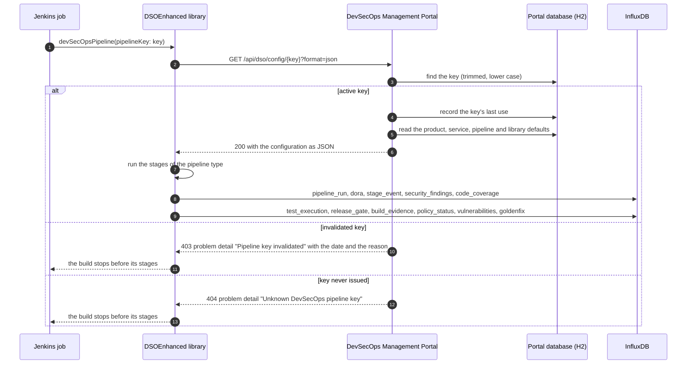
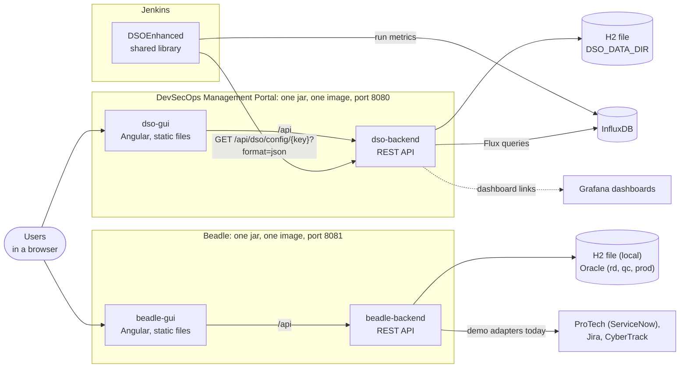
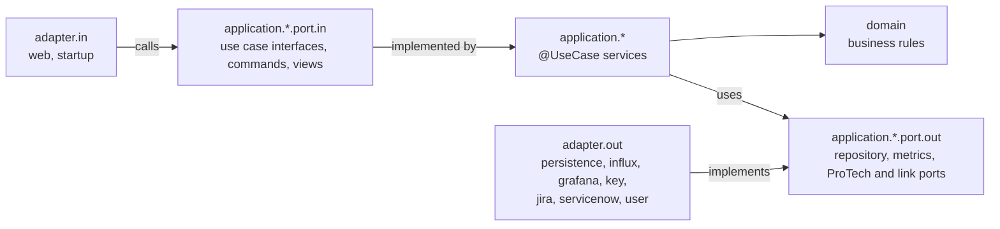
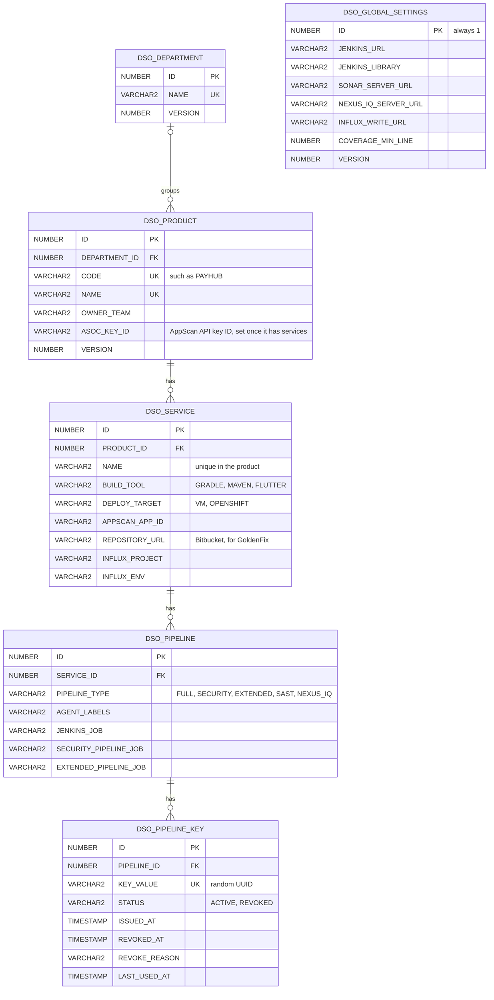

# BBH DevSecOps Management Portal and Beadle

Two web applications for BBH's DevSecOps, built by one Gradle build:

- the **DevSecOps Management Portal** (`dso-portal`): onboards products to DevSecOps, manages their pipelines and
  pipeline keys, watches the pipelines, and serves the configuration the Jenkins library
  [DSOEnhanced](https://github.com/mateuszmatan/DSOEnhanced) reads;
- **Beadle** (`beadle`): raises ProTech (BBH's ServiceNow) changes for production releases, their change tasks and
  their CyberTrack secure coding tickets, from the change template of each product.

Each application is an Angular GUI and a Spring Boot service of its own, packaged as one jar with the GUI inside and
as one container image, with its own database. The two know nothing of each other: the Beadle GUI shows no link to the
DevSecOps Management Portal and the portal none to Beadle, and either one builds, runs and deploys alone.

## Repository layout

```
settings.gradle, build.gradle   the root build: modules, repositories, versions, how an application is packaged
common-backend/                 code both services share: departments, errors, use case wiring, GUI forwarding
dso-backend/                    the DevSecOps Management Portal service (Spring Boot, port 8080)
beadle-backend/                 the Beadle service (Spring Boot, port 8081)
common-gui/                     the Angular code both interfaces share: shell, UI kit, departments, admin page
dso-gui/                        the DevSecOps Management Portal interface (Angular)
beadle-gui/                     the Beadle interface (Angular)
angular.json, package.json      the Angular workspace of the three GUI modules
deploy/openshift/               Dockerfile notes and the Kustomize manifests of each application
examples/                       Jenkinsfiles, API calls, a rendered configuration and GUI screenshots
```

| Module | Holds |
|--------|-------|
| `common-backend` | the departments (domain, use case and `/api/departments`), the problem detail error handling, the `@UseCase` transaction wiring, the clock, the forwarding of the GUI pages to `index.html`, the Liquibase history both databases start from and the test support both services use |
| `dso-backend` | products with their services and settings, pipelines and keys, the library defaults and the service template, the configuration rendered for DSOEnhanced, and the monitoring on InfluxDB and Grafana |
| `beadle-backend` | products with their change templates, ProTech changes with their change tasks and secure coding tickets, the lookups, the signed-in user, the demo Jira, ProTech and CyberTrack adapters and the Beadle demo data |
| `common-gui` | the application shell (header, menu, footer, titles), the UI kit (form fields, grid, chart, dialogs, toasts), the departments pages and dialogs, the Admin page with its tabs, the API error texts and the browser test support |
| `dso-gui` | Pipelines, Self-service, Pipeline Monitoring and DevSecOps Admin (Departments, Products, Service template, Library defaults) |
| `beadle-gui` | Changes, New Change and Beadle Admin (Departments, Products with their change templates) |
| `backend` | the launcher jar `backend/build/libs/dso-portal-<version>.jar`, which starts both applications together from their own jars inside it |

Only code that both applications use lives in a common module; everything else belongs to the application it serves.

## Build

Needs Java 17, and Node.js 20.19 or a later 20.x with npm 10.8 or a later 10.x on the `PATH` (the build calls `npm`
and `npx` from there, or the paths in `npm.executable` and `npx.executable` of `gradle.properties` when those files
exist). The Gradle wrapper downloads Gradle 8.14 from the BBH Nexus.

```bash
./gradlew build                     # both applications: the jars with the GUIs inside, the launcher, every test suite
./gradlew dsoJar                    # the DevSecOps Management Portal only: dso-backend/build/libs/dso-portal-<version>.jar
./gradlew beadleJar                 # Beadle only: beadle-backend/build/libs/beadle-<version>.jar
./gradlew :backend:bootJar          # both in one launcher: backend/build/libs/dso-portal-<version>.jar
./gradlew :dso-backend:bootJar -PskipGui   # a service without its GUI, for API work
./gradlew check                     # every suite of every module, see Tests
./gradlew sonar                     # SonarQube at tools.bbh.com/sonar, project DSOMgmtPortal, token in SONAR_AUTH_TOKEN
./gradlew publish                   # both jars to the BBH Nexus (bbhNexusUsername and bbhNexusPassword as Gradle properties)
./gradlew dsoJar -PartifactVersion=1.4.0
```

`dsoJar` and `beadleJar` build one application and nothing of the other: `dso-backend` depends on `common-backend`
and takes the bundle of `dso-gui` into its `static` folder, `beadle-backend` on `common-backend` and `beadle-gui`.
`:backend:bootJar` builds both and packs the two jars, unchanged, into the launcher jar of the `backend` module (see
[Running locally](#running-locally)). `publish` sends a `-SNAPSHOT` version to `nexus.snapshotsUrl` and any other to `nexus.releasesUrl`, both in
`gradle.properties`.

| File | Holds |
|------|-------|
| `settings.gradle` | the seven modules; whether the BBH Nexus is reachable, and the repositories that follow from it |
| `build.gradle` | the plugins, Java 17, SonarQube, the npm tasks and test suites of the GUI modules, the test suites and coverage gate of the backend modules, how each application packages and publishes its jar, and the launcher jar of `backend` |
| `<module>/build.gradle` | the dependencies of that module |
| `gradle.properties` | the BBH npm registry, proxy and CA file, the `npm`/`npx` paths on Windows and the Nexus URLs |
| `gradle/libs.versions.toml` | the plugin and library versions |
| `gradle/wrapper/gradle-wrapper.properties` | Gradle 8.14 from the BBH Nexus |
| `angular.json`, `package.json`, `.npmrc` | the Angular workspace: the projects `common-gui`, `beadle-gui` and `dso-gui`, the BBH npm registry and the Node.js and npm versions as hard requirements |

The GUI tasks run npm with the `npm.*` properties of `gradle.properties` as npm settings: `installNpmCIDeps`
(`npm ci`), `installDesignSystem` (`npm install --no-save` of the BBH Design System packages `@v6/v6-themes`,
`@v6/v6-table` and `@v6/v6-icons`, inside BBH only), and per GUI module `buildAngular` (`npx ng build <module>
--configuration=production` into `<module>/dist`) and `testAngular` (`npx ng test <module> --watch=false --coverage`,
Vitest on jsdom, so it needs no browser). The `processResources` of a service depends on the `buildAngular` of its GUI,
so `bootJar`, `bootRun` and the smoke tests always carry the current GUI; `-PskipGui` leaves it out.

The BBH Design System packages live only in the BBH npm registry, so `package.json` does not list them and `npm ci`
works anywhere. `-PdesignSystem.packages="@v6/v6-themes@21 @v6/v6-table @v6/v6-icons"` names other versions. The
tables use `ag-grid-enterprise` with only AG Grid's community features so far, so they need no licence; the build hands
BBH's licence key to AG Grid for the day an Enterprise feature is added: `-PagGridLicenseKey=...` or the
`AG_GRID_LICENSE_KEY` environment variable.

### Inside and outside the BBH network

The BBH Nexus, the BBH npm registry and the `njproxy` proxy only answer inside BBH, and the build needs no setting to
know where it is. `settings.gradle` asks the BBH Nexus for the Gradle distribution of the wrapper with one `HEAD`
request (3 seconds to connect): when it answers, plugins and libraries come from the BBH Nexus repositories, npm
packages from `tools.bbh.com/nexus/repository/npm-group` through `njproxy` with the BBH CA file, the Design System is
installed and the GUIs build with the BBH Design System. When it does not, the build says so once ("The BBH Nexus is
out of reach") and uses the Gradle Plugin Portal, Maven Central and `https://registry.npmjs.org/`
(`npm.publicRegistry` names another), switches the `njproxy` proxy properties off, skips `installDesignSystem` and
builds the GUIs with the `public` configuration, which swaps the BBH Design System styles and icons for a navy Bootstrap
theme with the same layout. The same build therefore works on a BBH workstation and on any other machine.

`-PbbhNetwork=true` or `false` (also as `bbhNetwork=` in `~/.gradle/gradle.properties`) overrides the check. The
wrapper's own Gradle download sits on the BBH Nexus too, so `gradlew` and `gradlew.bat` make the same check before
they start: when the BBH distribution does not answer, they run the wrapper from a copy in `.gradle/public-wrapper`
whose `distributionUrl` points at `https://services.gradle.org/distributions/gradle-8.14-all.zip`, and Gradle 8.14
is downloaded from there once. `./gradlew build` is therefore the same command everywhere. A machine behind its own
proxy sets `systemProp.https.proxyHost` and `systemProp.https.proxyPort` in `~/.gradle/gradle.properties`, which win
over the project's. Running npm by hand outside BBH needs `--registry=https://registry.npmjs.org/`.

## Running locally

Build the jar of an application and start it; each one serves its GUI and its API on its own port.

```bash
./gradlew dsoJar
java -jar dso-backend/build/libs/dso-portal-0.1.0-SNAPSHOT.jar        # http://localhost:8080

./gradlew beadleJar
java -jar beadle-backend/build/libs/beadle-0.1.0-SNAPSHOT.jar         # http://localhost:8081
```

`./gradlew :dso-backend:bootRun` and `./gradlew :beadle-backend:bootRun` do the same without building the jars.
Both can run at the same time, and either one alone. One command starts the two together:

```bash
./gradlew :backend:bootJar
java -jar backend/build/libs/dso-portal-0.1.0-SNAPSHOT.jar             # http://localhost:8080 and http://localhost:8081
```

That jar is a launcher: it carries the two application jars above, unchanged, and starts each one in its own JVM with
the `java` that runs the launcher (Java 17 or 21), so the applications stay as independent as when started by hand,
each on its own port, database and GUI. The environment variables and the command line arguments of the launcher reach
both applications; the launcher ends when either application ends, stopping the other, and Ctrl+C stops all three.

**The DevSecOps Management Portal** starts with an empty, persistent database: an embedded H2 in Oracle mode in the
file `~/bbh-devsecops/dso-portal/dso-portal.mv.db` (`DSO_DATA_DIR` moves the folder). Liquibase creates the schema on
the first start with the five BBH departments (AI Lab, Capital Partners, Corporate Technology, Custody and Fund
Services) and the BBH library defaults, and nothing else: no product, service, pipeline or key is made up, so the
portal can be used for real from the first start. Every later start finds the data where it was left; the schema is
updated in place when a new version adds to it. The database file is the portal's data: back up the folder, and move
it with `DSO_DATA_DIR` when the portal moves. The portal has no Oracle profile: whichever profile is switched on, it
stays on its H2 file (`rd` only turns the logging up to DEBUG). `DB_USERNAME` and `DB_PASSWORD` protect the H2 file
(`sa` without a password by default, set them before the first start). Pipeline Monitoring reads
InfluxDB, so without `INFLUX_URL` it says that the administrator has to set it and shows no runs:

```bash
INFLUX_URL=https://influx.example.com INFLUX_TOKEN=... \
GRAFANA_DASHBOARD_URL=https://grafana.example.com/d/adzfc54123/devsecops-pipeline-long \
GRAFANA_SECURITY_DASHBOARD_URL=https://grafana.example.com/d/ad2trcm/devsecops-pipeline-security \
  java -jar dso-backend/build/libs/dso-portal-0.1.0-SNAPSHOT.jar
```

The dashboards are the ones DSOEnhanced ships (`grafana/` in that repository); the portal opens them with the
service's `project` variable and the selected time range. Security, SAST and Nexus IQ GoldenFix pipelines open the
security dashboard, the other pipelines the pipeline dashboard. Grafana must let portal users view them. A second
Grafana instance takes `GRAFANA_2_DASHBOARD_URL` and `GRAFANA_2_SECURITY_DASHBOARD_URL`, and each instance is named
with `GRAFANA_NAME` and `GRAFANA_2_NAME` (`Grafana` and `Grafana 2` when unset). The pipeline page then embeds the
dashboard of every instance that has one for the pipeline, under the instance's name, so two Grafanas can share the
dashboards, or one can hold the pipeline dashboard and the other the security one. An instance without the security
dashboard shows its pipeline dashboard for security pipelines too, and an instance without the pipeline dashboard
shows nothing for the other pipelines.

**Beadle** starts with the `local` profile: an embedded H2 in Oracle mode in `~/bbh-devsecops/beadle/beadle.mv.db`
(`BEADLE_DATA_DIR` moves the folder) and demo data, so the ProTech workflow can be tried at once; `BEADLE_DEMO_DATA=false`
starts it empty but for the five departments. Jira, ProTech and CyberTrack are demo adapters until the real ones are
connected (see [Demo ProTech and the real adapters](#demo-protech-and-the-real-adapters)), and the pages say so with a
"Demo mode" banner. On `rd`, `qc` and `prod` Beadle runs on Oracle:

```bash
SPRING_PROFILES_ACTIVE=qc DB_URL=jdbc:oracle:thin:@//<host>:1521/<service> DB_USERNAME=BEADLE DB_PASSWORD=... \
  java -jar beadle-backend/build/libs/beadle-0.1.0-SNAPSHOT.jar
```

A database written by the single portal of earlier versions (`./data` next to the jar) is not reused: each
application starts its own database at its new location, and a database pointed at one application loses the tables
of the other (see [Data model](#data-model)).

For GUI work, the Angular development servers rebuild on every change and proxy `/api` to the service of their
application: `npm start` serves `dso-gui` on http://localhost:4200 against port 8080, `npm run start:beadle` serves
`beadle-gui` against port 8081; `npm run start:public` and `npm run start:beadle:public` do the same without the BBH
Design System.

### Configuration

Both services read `bbh-devsecops-common.yml` from `common-backend` (JPA, Liquibase, actuator health and info) and
their own `application.yml`.

The DevSecOps Management Portal:

| Variable | Default | Meaning |
|----------|---------|---------|
| `PORT` | `8080` | HTTP port |
| `DSO_DATA_DIR` | `~/bbh-devsecops/dso-portal` | the folder of the H2 database `dso-portal.mv.db` |
| `DB_USERNAME`, `DB_PASSWORD` | `sa`, empty | the H2 user; set before the first start, since H2 creates the user with the database |
| `SPRING_PROFILES_ACTIVE` | none | `rd` logs the portal at DEBUG; `qc` and `prod` change nothing yet |
| `INFLUX_URL`, `INFLUX_TOKEN` | empty | your InfluxDB; empty switches Pipeline Monitoring off and tells the administrator what to set |
| `INFLUX_ORG`, `INFLUX_BUCKET` | `DevSecOps`, `DORA-metrics` | where DSOEnhanced writes its metrics |
| `GRAFANA_DASHBOARD_URL` | empty | link to the DSOEnhanced pipeline dashboard; empty leaves this instance without one, and without any link the pipeline page shows no dashboard |
| `GRAFANA_SECURITY_DASHBOARD_URL` | empty | link to the security dashboard for `SECURITY`, `SAST` and `NEXUS_IQ` pipelines; empty uses the pipeline dashboard |
| `GRAFANA_NAME` | `Grafana` | the name of that Grafana instance on the pipeline page |
| `GRAFANA_2_DASHBOARD_URL`, `GRAFANA_2_SECURITY_DASHBOARD_URL`, `GRAFANA_2_NAME` | empty, empty, `Grafana 2` | the same for a second Grafana instance; both empty links leave it out |

Beadle:

| Variable | Default | Meaning |
|----------|---------|---------|
| `PORT` | `8081` | HTTP port |
| `SPRING_PROFILES_ACTIVE` | `local` | `local` runs on H2, `rd`, `qc` and `prod` on Oracle (`rd` logs at DEBUG) |
| `BEADLE_DATA_DIR` | `~/bbh-devsecops/beadle` | the folder of the H2 database `beadle.mv.db` of the `local` profile |
| `DB_URL`, `DB_USERNAME`, `DB_PASSWORD` | H2 with `local`; required with `rd`, `qc`, `prod` | the database of the active profile |
| `DB_POOL_SIZE` | 5, 10, 20 in `rd`, `qc`, `prod` | Oracle connection pool size |
| `BEADLE_DEMO_DATA` | `true` with `local`, `false` otherwise | the demo products with their change templates and the demo changes; see [Beadle demo data](#beadle-demo-data) |
| `DSO_SIGNED_IN_USER` | `Mateusz Matan` | the signed-in user (`GET /api/me`, Opened by of a new change and the default requester and assignee) until BBH single sign-on exists |
| `CYBERTRACK_URL`, `CYBERTRACK_TOKEN` | empty | the Jira of CyberTrack and its token; empty creates demo secure coding tickets (see [Secure coding ticket](#secure-coding-ticket)) |
| `CYBERTRACK_PROJECT_KEY`, `CYBERTRACK_ISSUE_TYPE` | `SCP`, `Task` | the Jira project and issue type of a secure coding ticket |

Liquibase creates and updates the schema at start-up, on H2 and on Oracle. Secrets never reach either application:
services name Jenkins credentials IDs, and the generated configuration carries only those IDs.

## Containers and OpenShift

Each service has its Dockerfile (`dso-backend/Dockerfile`, `beadle-backend/Dockerfile`: UBI 9 with Java 17, any
non-root UID, the Spring Boot layers extracted) and its Kustomize manifests with `rd`, `qc` and `prod` overlays
(`deploy/openshift/dso-portal`, `deploy/openshift/beadle`). The portal's image keeps its H2 database on a persistent
volume at `/application/data`; Beadle's image takes its Oracle connection from a secret.
[deploy/openshift/README.md](deploy/openshift/README.md) describes building, running and deploying both images.

## The DevSecOps Management Portal

The portal's menu has four sections:

- **Pipelines**: the DevSecOps pipelines of your department. Pick your department (the browser remembers it) and see
  its pipelines in a table you can sort and filter in the header: service, product, pipeline type, Jenkins job,
  pipeline key (by its hint, or Invalidated), the result of the last run and when it finished. **Set up pipelines in
  Self-service** opens the wizard. **Edit** in a row changes the pipeline's Jenkins agents, Jenkins job and
  description; when someone else saved the pipeline meanwhile, the dialog loads their settings and says so, so you
  make your change again on top of them. A row opens the page of its pipeline: the result of its last run, the
  pipeline key (shown on request and copied whole) with when it was issued and last used by Jenkins, its settings, the
  Jenkinsfile ready to copy and up to five of its latest runs of the past 30 days, with **Open in Jenkins** and a link
  to every run and the delivery performance (DORA) in Pipeline Monitoring. **Edit settings** opens the same dialog,
  and its **More** menu opens the product in Admin, shows the settings sent to Jenkins (config.yaml) and the key
  history, replaces or invalidates the key and deletes the pipeline; an invalidated key is regenerated with one button.
- **Self-service**: a step-by-step wizard for app owners who do not know DevSecOps. It sets up a new product or
  changes one already in the portal: choose the department and the product, then the pipeline, in this order: SAST
  (Static Application Security Tests) - HCL AppScan, OSA (Open Source Analysis) (NexusIQ with Golden Fix and Golden Pull
  Request), Security (Unit Tests, NexusIQ, SAST, SonarQube) or Full (Static Security (unit test, NexusIQ, SAST,
  SonarQube) + Extended (lower test region deployment, regression, performance, smoke, DAST, higher test region
  deployment)); for a product in the portal the step shows which pipelines each service has today and how many
  services already have each one. Then the services: add new ones (name, AppScan application, Gradle or Maven, virtual
  machines or OpenShift; for OSA also the Nexus IQ application and the Bitbucket repository of each service), change
  the existing ones (including their build tool and where they run) or remove them. Each step asks one question, and
  the button at the bottom names the next step (**Next: Services**). The review ("Is everything right?") says what
  happens to each service, tagged New, Changed or Removed, and which pipelines a removal deletes; nothing is saved
  until **Create the pipelines** (**Save the changes** for a product in the portal). The last step lists what to do
  next in order: the Jenkinsfile of each service ready to copy, with the repository it goes into, the Jenkins job to
  ask for per service, the first run and where to follow the results. The build tool and where a service runs start
  from the library defaults; the OpenShift project, the Nexus IQ application, the Bitbucket repository, the build and
  the Jenkins job of each pipeline are filled in from the service template, and every value can be changed. New
  services, and services that change their build tool or where they run, wait for the service template: when it
  cannot be loaded, the Services step says so and offers **Try again**. Everything else comes from the BBH library
  defaults and can be fine-tuned in Admin.
- **Pipeline Monitoring**: "Latest results" counts the pipelines and how their latest runs ended (Passed, Failed or
  passed with warnings, Keys invalidated), with a chart of them by department; "Products" lists every product with
  the results of its pipelines, grouped by department; "Delivery performance (DORA)" rates the four DORA measures of
  all pipelines over the last 30 days (today and the 29 days before it, in UTC, so the totals add up to the daily
  bars) as Elite, High, Medium or Low, each with a one-line meaning, above their runs per day. A product shows each
  pipeline with its latest run and how many of its stages passed; a pipeline shows its delivery performance, runs per
  day, latest run, recent runs, the Jenkins job and your DSOEnhanced Grafana dashboard over a period of 7, 30, 90 or
  180 days, and names the time zone of its times. Everything is read from the InfluxDB the pipelines write to. A run
  reads Passed, Passed with warnings, Failed, Stopped or Not built; a pipeline without runs shows No runs yet, and one
  whose key was invalidated Key invalidated.
- **Admin**, for the portal administrator, in four tabs:
  - **Departments**: add, rename and delete departments (only an empty one can be deleted, and a disabled Delete says
    why), each with the number of its products, services and pipelines ("12, all active" or "12, 2 keys
    invalidated"), and the chart "Pipelines per department" of the active pipelines and those whose key was
    invalidated. The five BBH departments come with the database.
  - **Products**: add a product with all of its services and every setting the DevSecOps library reads from
    `config.yaml` today, edit or delete it. Every new service gets a full pipeline with its own key; keys can be
    invalidated, regenerated and linked to a Jenkins job, and each service names the Bitbucket repository where
    DSOEnhanced raises its GoldenFix pull requests. The product page lists each service with its build tool, where it
    is deployed, its Bitbucket repository and its pipelines with their key, Jenkins job, Jenkins agents and monitoring
    tags; **Edit product** opens the editor, **Add pipeline** adds a pipeline to a service, and the **More** menus of
    the product and of each pipeline hold the rest: the settings sent to Jenkins (config.yaml), monitoring, the
    Jenkinsfile, the key history, the pipeline settings, the key actions and deleting. In the editor **Edit settings**
    opens a service, and the rarely changed settings of a section sit in its collapsed **Advanced settings** panel,
    which opens by itself when a field in it needs attention.
  - **Service template**: what a new service and a new pipeline get, in Self-service and in the Add service and Add
    pipeline forms: the Jenkins agents and job of a pipeline, the Gradle and Maven tasks and artifacts, the Nexus IQ
    application, scan patterns and Bitbucket repository, and the OpenShift project, image registry and health check.
    The names take the placeholders `{CODE}` (the product code), `{code}` (the same in lower case) and `{service}`,
    and the job also `{type}` (full, security, extended, sast or nexusiq), so `DevSecOps/{CODE}/{service}-{type}`
    names the full pipeline of `backend-api` in CERT `DevSecOps/CERT/backend-api-full`. The panel "What a new service
    gets" shows what a service gets while you type and what each placeholder stands for.
  - **Library defaults**: the DSOEnhanced library defaults every pipeline shares, in the sections Tools and servers,
    Deployment defaults, Security limits, Scans and coverage, Release gate, Service defaults and GoldenFix defaults.
    They replace the library's `defaults.yaml`. A service can set its own SonarQube, Nexus IQ and InfluxDB values and
    its own deployment, service and GoldenFix values in the product editor. **Show settings sent to Jenkins** shows
    the part of `config.yaml` every pipeline receives, built from the saved defaults. The open source scan (SCA) has
    only its security limits, and the release gate result file is always `release-gate.json`, the one file the
    security pipeline archives and the extended pipeline copies, so it is shown read-only and always sent.

No `config.yaml` remains in the product repositories. The portal-integrated library reads each pipeline's
configuration from the portal by its key, so a service needs only the generic Jenkinsfile and its pipeline key:

```groovy
@Library('DevSecOpsJenkinsLibrary') _

devSecOpsPipeline(pipelineKey: '6f1c2d3e-0000-4abc-9def-123456789abc')
```

A run that builds several services of one product passes the keys of their pipelines of that type, the primary service
first; the product page offers this Jenkinsfile as "Jenkinsfile for several services" in the **More** menu of a
pipeline, and the page of a pipeline in Pipelines shows its own. Extended pipelines join only when they name the same
security pipeline, since the run reads the security run state of the primary's only:

```groovy
devSecOpsPipeline(pipelineKeys: ['6f1c2d3e-0000-4abc-9def-123456789abc', 'a1b2c3d4-0000-4abc-9def-123456789abc'])
```

During the cutover, pin the portal-integrated library version (for example `DevSecOpsJenkinsLibrary@main`) in the
shared library of Admin > Library defaults (`platform.jenkinsLibrary`, the name the generated Jenkinsfiles load) and in
the `@Library` line of every migrated job, until every job carries a key.

### How DSOEnhanced reads its configuration

| Request | Answer |
|---------|--------|
| `GET /api/dso/config/{key}` | 200 with the pipeline's `config.yaml` (`?format=json` for JSON), recording the key's last use; 403 with the reason once the key is invalidated; 404 for a key never issued |
| `GET /api/pipelines/{id}/config` | the same configuration for the portal UI, without recording a use |
| `GET /api/products/{id}/config` | every service of a product as one `config.yaml` |
| `GET /api/settings/config` | the part of every configuration that comes from the library defaults |

The library reads each pipeline's configuration from the portal over HTTPS, with one
`GET /api/dso/config/<key>?format=json` per key, sent with `curl` from a Jenkins agent before the pipeline starts.
The portal renders the configuration from its database at that moment and records the key's last use. Jenkins needs
only the portal's address, the global environment variable `DSO_PORTAL_URL` (for example
`https://dso-portal.apps.bbh.com`); it holds no database account, no credentials and no driver, and only the portal
reaches its database. Jenkins jobs never reach that database: the library asks for the configuration by key, writes
its run metrics to InfluxDB, and raises its GoldenFix pull requests in the service's Bitbucket repository; the portal
reads the metrics back for Pipeline Monitoring and links the DSOEnhanced Grafana dashboards.



The key is the only check. Whoever holds a key reads the configuration of that one pipeline, which names Jenkins
credentials IDs and no passwords, much as anyone who could read a product repository could read its `config.yaml`.
Keys are random UUIDs, the API lists none of them by this request, and an invalidated key is refused with 403 at once.
When the portal moves behind BBH SSO, `/api/dso/config/**` stays outside the sign-in.

Every key the library reads per service is a setting of the service. A service may name its own Nexus IQ server and
credentials, SonarQube server, InfluxDB write URL and credentials, and AppScan secret (a Secret text credentials ID);
left empty, the configuration carries the library default or, for the AppScan secret, the product's. One Nexus IQ
application is written as `tools.nexusIq.application: <name>`; several are written as a map of applications, each
entry with its scan patterns, stage and the effective server and credentials.

A pipeline's metrics are matched by the InfluxDB tags the library writes: `project` (the service's metrics project
plus the pipeline type suffix: none for full, `security`, `extended`, `sast`, `nexusiq`) and `env`. Several services
may share one metrics project and env. Under a shared tag a `pipeline_run` belongs to the pipeline whose Jenkins job
(or a branch of it) recorded it in the `job` field; a pipeline without a Jenkins job shows no run, and a run of one job
building several services belongs to each of them. DORA metrics and the Grafana dashboard stay per tag. Concurrent runs
under one tag can still mix the points the library writes without a `module` tag.

### Nexus IQ GoldenFix pipeline

A Nexus IQ GoldenFix pipeline (`NEXUS_IQ`, Jenkinsfile `devSecOpsNexusIqGoldenFixPipeline(pipelineKey: '<key>')`,
job `DevSecOps/<CODE>/<service>-nexusiq`) runs three stages: *Monitor source changes (download sources)*, *Build
artifact* and *Dependencies scan (Nexus IQ)*. When the scan reports a policy violation, GoldenFix applies the upgrades
Nexus IQ offers and raises the golden pull request `GoldenFix-<yyyyMMddHHmm>` in the service's Bitbucket repository.
The pipeline deploys nothing and runs no other scan.

Its configuration (`pipeline.type: nexusiq`) carries the service's settings like any other pipeline and links no
security or extended job. The service needs its Nexus IQ applications, with scan patterns that match the artifacts the
build produces; its Bitbucket repository and credentials ID (`scm.bitbucket`), without which the library records
`NOT_CONFIGURED` and raises no pull request; GoldenFix switched on, by the service's own switch or by the GoldenFix
defaults of the library defaults; and an AppScan application, which every service keeps whatever its pipelines. Its
metrics carry the project suffix `nexusiq` and its Grafana links open the security dashboard of every instance.

### Accepted differences from config.yaml

Moving the configuration into the portal changes these behaviours of the library on purpose:

1. Configuration lives in the portal, not in the repository: no per-branch, per-PR or per-commit configuration; a
   replay of an old build uses today's portal values; release and develop jobs of one service share one pipeline per
   type. The console, the report header and `build_evidence` record the key hint, `renderedAt` and the sha256 hint.
2. Failures before `pipeline {}` leave no report, `release-gate.json` or InfluxDB point; `build_duration` and the DORA
   duration include the bootstrap read.
3. The archived run-state file is `pipeline-config.yaml`, not `config.yaml`; the first extended run after cutover needs
   one security build made by the new library.
4. The extended pipeline uses its own key's projects plus the security run's run-time tags, not the security run's
   whole `config.yaml` copy.
5. Keys the portal does not model are gone from `getCFG()` (custom keys a team added to `config.yaml`);
   `tests.<suite>.defaults`, bare-string test jobs and `urls` are expanded by migration into jobs; `jobs[].auth` maps
   other than credentials IDs, OpenShift `appName`/`imageNamespace`/`cluster`/`credentialsId` (only the unused
   nexusDelivery API reads them) and the keys the library no longer reads are not modelled.
6. Selecting projects through `PROJECT_NAMES`/`PROJECT_NAME` without keys is gone; the keys decide.
7. Texts that named `config.yaml`/`defaults.yaml` now name the portal, also where they reach the report,
   `release-gate.json` and InfluxDB. A Jenkinsfile `securityPipeline` in a full, security, SAST or Nexus IQ GoldenFix
   pipeline is ignored, which shows the Nexus IQ and SonarQube summary rows it used to hide.
8. Nexus IQ report links appear for every service, because the IQ server URL is a library default (GoldenFix stays
   governed by its own per-service switch).
9. Every build depends on the portal at start; the agents of the `DSO_PORTAL_AGENT` label need HTTPS access to it.

### REST API of the portal

| Method and path | Purpose |
|-----------------|---------|
| `GET /api/departments` | departments by name, each with the number of its products, their services, their pipelines and the pipelines with an active key |
| `POST /api/departments`, `PUT`/`DELETE /api/departments/{id}` | add, rename or delete a department; `PUT` carries the `version` it was read at; a department that still has products is not deleted (409) |
| `GET /api/products?search=` | products with their department, service and pipeline counts; the search also matches the department name |
| `POST /api/products`, `GET`/`PUT`/`DELETE /api/products/{id}` | a product in its department (`departmentId`, required on every save) with its complete list of services and its AppScan account (`appScan`, whose `keyId` is required once the product has a service); `PUT` carries the `version` it was read at; every service the save creates gets a full pipeline with an active key, or with `?pipelineType=SAST\|NEXUS_IQ\|SECURITY\|FULL` every service of the product without a pipeline of that type gets one; `DELETE` removes the product with its pipelines and keys |
| `GET /api/products/code-suggestion?name=` | the code the portal suggests for a new product's name: its letters and digits in upper case, with a number added when another product has that code |
| `GET /api/products/{id}/pipelines` | each service of a product with its pipelines |
| `POST /api/services/{id}/pipelines` | add a pipeline; it starts with an active key |
| `GET /api/pipelines?departmentId=` | the pipelines of a department's products as `{pipelines, metricsError}`, by product and service, each with its status and last run and its key by its hint; 404 for an unknown department |
| `GET`/`PUT`/`DELETE /api/pipelines/{id}` | a pipeline with its key history and its `version`; `PUT` may carry the `version` it was read at (409 when stale) |
| `POST /api/pipelines/{id}/keys` | issue a new key; an active key is invalidated with the reason "Replaced by a new key"; on a pipeline whose key was invalidated this is Regenerate, and the old keys stay refused |
| `POST /api/pipelines/{id}/keys/revoke` | invalidate the active key, with a `reason` of at most 500 bytes; 409 when the pipeline has no active key |
| `GET /api/dso/config/{key}`, `GET /api/pipelines/{id}/config`, `GET /api/products/{id}/config`, `GET /api/settings/config` | the DSOEnhanced configuration as YAML, or as JSON with `?format=json`; see [How DSOEnhanced reads its configuration](#how-dsoenhanced-reads-its-configuration) |
| `GET /api/monitoring/status`, `/products`, `/products/{id}`, `/pipelines/{id}?range=30d` | monitoring data; `status` says whether InfluxDB is configured and reachable and names the Grafana instances |
| `GET /api/monitoring/activity?range=30d` | the DORA summary and the daily activity of all pipelines together, as `{pipelines, dora, metricsError}`: the number of pipelines, the DORA metrics over the range with `dora.daily` (runs, failures and deployments per day), and the metrics error, if any |
| `GET`/`PUT /api/settings` | the DSOEnhanced library defaults (Admin > Library defaults); `PUT` carries the `version` it was read at |
| `GET`/`PUT /api/service-template` | the template of a new service (Admin > Service template): `agentLabels`, `jenkinsJob`, the Gradle, Maven and Flutter tasks, artifacts and scan patterns, `deliveryTasks`, `nexusIqApplication`, `repositoryUrl`, `bitbucketCredentialsId`, `openShiftProject`, `imageRegistry` and `healthCheckUrl`; `version` is `null` until it is saved (it then holds the BBH defaults), and `PUT` carries the `version` it was read at (409 when stale); a placeholder other than `{CODE}`, `{code}`, `{service}` (and `{type}` in the job) is refused, and so is a name too long for its column once the longest code and service name are filled in |

A `range` is a number of days from `1d` to `730d`, `30d` when left out. Errors are RFC 9457 problem details;
validation errors name the failing fields, for example `services[2].build.javaPath`. Key values are only sent by the
product management endpoints, and only for the active key; everywhere else a key shows as its hint.

## Beadle

Beadle's menu has three sections:

- **Changes**: the ProTech changes of your department. Pick your department (the browser remembers it) and see its
  changes in a table you can sort and filter in the header: change number, product, FixVersion, the ProTech workflow
  state with what it means ("Waiting for the L1 approver"), the installation window, the short description, the
  number of change tasks and when it was raised; **Raise a change** opens New Change. Opening a change reads it from
  ProTech first, so what was changed there (texts, schedule, fields, approvals, CTASKs and their states) shows at
  once. "Where the change is" names its state, what it waits for (the approver by name, or how many change tasks are
  approved) and the workflow progress through Draft, Business Approval, Primary Approval, Secondary Approval, Support
  Approval, CTask approval, Escalated approval, In Progress and Closed; **Approvals** lists the business, L1, L2 and
  support approvals and the approval of every change task, each with its approvers, its state (Not Approved,
  Requested or Approved) and its last reminder, with a discreet **Remind** on each approval still awaited and
  **Remind everyone who has not approved** for the whole change (see [Approvals and reminders](#approvals-and-reminders));
  "The change at a glance" shows when it installs and what it delivers; then come its change tasks, each with every
  field of the change task form, read-only, and its state in words, and two collapsed panels: "All ProTech fields",
  with its change number, approval (Not Approved in Draft, Requested in the approval stages, Approved from In Progress
  on) and who opened it, and "Text sent to ProTech". An open change
  can be edited by its department with **Edit the change** (**Edit change** in its row), in the same sections as New
  Change: the update is published to ProTech at once, and Beadle checks and shows whether ProTech applied it (the row
  says "Update pending" until then). While an open change of your department has no secure coding ticket, a note on
  its page offers **Create the secure coding ticket** (see [Secure coding ticket](#secure-coding-ticket)). While Jira,
  ProTech or CyberTrack is not connected, a "Demo mode" banner on Changes and New Change says so.
- **New Change**: the guided wizard that raises a change for a production release. A bar shows its steps with their
  numbers: eight until the change is created ("Step n of 8" heads each one), then **Add CTASKs** and **Secure
  coding** join them and a **Summary** ends the wizard. The button at the bottom names the next step (**Next: Jira**).
  Choose the department and the product: the product's change template fills in every step, and each value can be
  changed for this change. A magnifier next to a person, the department, the assignment group, the release, the
  affected CI, the incident, the problem and the affected clients searches ProTech (see [Lookups](#lookups)) and fills
  the field with the value picked (affected clients adds it to the list); every such field also takes free text. The
  steps:
  1. **Request details**, in two columns: the change number (given by ProTech when the change is raised), approval
     (Not Approved), Opened by (the signed-in user) and state (Draft), all read-only; then requested for,
     requested by, department, assignment group, category, assigned to, type, release, affected CI, incident, direct
     business service, problem, risk, affected clients and users affected. Requested for, requested by and assigned to
     default to the signed-in user and the department to the product's department; the direct business service comes
     with the CI picked from the search and the risk is worked out from the risk assessment, so neither is typed.
  2. **Jira**: type the FixVersion, the Jira release the change delivers (the known versions are offered, unreleased
     first, and one typed in another case takes Jira's spelling); its epics are listed, and choosing epics loads their
     stories. The short description and the description are written from the choice under "Text sent to ProTech" and
     stay editable.
  3. **Approval and notification**: business approver, L1 approver, L2 approver and support approver.
  4. **Schedule**: the installation start and its hours, the post-install validation start and its hours, the first
     use and, when the change has downtime, the downtime start and its hours, which default to the installation
     window. The template's start time and hours are the defaults, on the release date of the FixVersion while that
     start is still ahead, otherwise on the next day.
  5. **Planning**: test summary, implementation plan, validation plan, backout plan and first use plan.
  6. **Privileged access**: how many privileged accounts (none to seven), each on one line: the person (with a
     magnifier) on the left and the privileged access on the right.
  7. **Risk assessment**: nine questions in two columns, each answered from a fixed list; the template's answers are
     the defaults.
  8. **Review**: every value of the change and the text sent to ProTech, which can still be changed; **Create and add
     CTASKs and SecureCoding ticket** creates the change (CHG) in ProTech, which gives it its number. A CTASK can
     only be created under a CHG that exists, so the two steps that need the number follow.
  9. **Add CTASKs**: the change tasks (CTASK) of the created change, prefilled from the default change tasks of the
     template (see [Change tasks](#change-tasks)) and created against its number with **Create the CTASKs in
     ProTech**; **Add CTASKs later** skips them, and **Edit the change** on the change page adds them afterwards.
  10. **Secure coding**: the secure coding ticket of the change in CyberTrack (see
      [Secure coding ticket](#secure-coding-ticket)), its inputs filled in from the template; **Create the secure
      coding ticket in CyberTrack** creates it, and **Create the ticket later** leaves it to the change page.
  11. **Summary**: the change number and the secure coding ticket number (both read-only), the FixVersion, the
      installation window, the change tasks and what happens next, with **Open the change** and **Create another
      change**.
- **Admin**, in two tabs: **Departments** (add, rename and delete departments, each with the number of its products
  and of the changes raised for them; a department with products or changes cannot be deleted, and a disabled Delete
  says why) and **Products**: every product by department with the state of its change template, "Filled in" (with
  when it was saved) or "Not filled in yet". Add a product with its name, product code, department, owner team and
  contact e-mail; its page opens next. On its page **Edit details** changes its name, department, owner team and
  contact e-mail (a name another product has keeps the dialog open with your edits), **Delete product** deletes it
  with its change template, and its **change template** keeps the ProTech fields in the sections and order of New
  Change and the default change tasks of its changes. Until the template is saved, the new changes of the product
  start with values suggested from its name, code and owner team.

Beadle's products are its own: a product is a name, a code, a department, an owner team and a contact e-mail, enough
to raise changes for it. ProTech knows no services or pipelines, so Beadle neither stores nor shows them; the
DevSecOps Management Portal keeps its own products with their services and settings.

### Change templates

Every product has a **change template**, kept by the administrator in Beadle Admin on the product's page:

- **Request details**: requested for, requested by, department, assignment group, category, assigned to, type,
  release, affected CI, incident, direct business service, problem, affected clients and users affected. The category
  is one of Application, Hardware, Infrastructure, System Software, Network, Telecom, Data Amendment, Desktop
  Software, Storage, Facilities, Other and Database, and the type one of Standard, Emergency, Business Critical and
  Model. An empty requested for, requested by or assigned to means the user who raises the change, and an empty
  department the department of the product, as the notes under those fields say ("If left empty: the user who opens
  the change", "If left empty: the department of the product").
- **Jira**: the Jira project key the epics and stories of a release come from.
- **Approval and notification**: business approver, L1 approver, L2 approver and support approver.
- **Schedule defaults**: downtime yes or no, the installation start time, how many hours the installation takes and
  how many hours the post-install validation takes.
- **Planning**: test summary, implementation plan, validation plan, backout plan and first use plan.
- **Privileged access**: yes or no; when yes, up to seven users, each with the name of their privileged account.
- **Risk assessment**: nine questions, each answered from its list (below); an answer left out is the first of its
  list.
- **Secure coding**: the defaults of the secure coding ticket: APO number, Bitbucket URL, artifact link and QC
  application link (see [Secure coding ticket](#secure-coding-ticket)).
- **Change tasks**: the default CTASKs of a change, one to fifty, in the same form as
  [Change tasks](#change-tasks); the fields the change gives a task (the number, the change number, the approval and
  its approvers, the installation window and the task start) stay empty and say where their value comes from.

| Question | Answers |
|----------|---------|
| Number of BBH workgroups impacted (`bbhWorkgroups`) | Single, 2-3, More than 3 |
| Complexity of the change (`changeComplexity`) | Simple, Moderate, Very |
| Number of BBH users impacted (`bbhUsers`) | Less than 5, 5-25, 26-250, All users |
| Complexity of validation (`validationComplexity`) | Simple, Moderate, Very |
| Number of applications impacted (`bbhApplications`) | Single, Two, More than 2 |
| Backout testing & duration (`backoutTesting`) | Less than 30 minutes, 30 mins - 2 hours, Greater than 2 hours, Unable to test |
| Number of impacted clients outside BBH (`clientsOutsideBbh`) | No clients, Single, More than one but not all, All clients |
| Platform status (`platformStatus`) | Existing, New, Decommissioned |
| Business impact (`businessImpact`) | None, Low, Medium, High |

A category, a type or an answer off its list is refused with 400 on that field, for example
`riskAssessment.bbhUsers`. The lists live once in the domain (`ChangeTemplate`, `RiskAssessment`) and reach the GUI
through `GET /api/changes/options`. Nobody types the **risk**: Beadle works it out from the answers whenever a
template or a change is read or saved, and ignores a risk it is sent. It is **High** when any answer is the last of
its list (More than 3, Very, All users, More than 2, Unable to test, All clients, Decommissioned, High), else
**Moderate** when any answer is past the first of its list, else **Low**.

A product without a saved template gets suggested values from its code, name and owner team (category Application,
type Standard, the product as affected CI), and two suggested change tasks: "Deploy <product> to production" for
Release Management with the product as its application, and "Validate <product> in production" for the assignment
group of the template.

### Lookups

The magnifiers of the wizard and of the template form search ProTech through the out port `ProTechLookupPort` with
`GET /api/lookups/{kind}?q=`: `users`, `departments`, `assignment-groups`, `releases`, `configuration-items`,
`incidents`, `problems` and `clients`. Each answer holds at most 20 entries that contain the text, ignoring case,
in their `value` (what fills the field) or their `detail` (an e-mail address, a cost centre, the department, the
product code, the business service or a short description); an empty text lists the first 20. Beadle ships a demo
adapter (`DemoProTechLookups`) only: BBH people (the signed-in user and the demo approvers among them), the
departments and a few more, an application support group per owner team and the infrastructure groups, three releases
per product, the products as configuration items with their owner team (or department) as their business service, and
a steady set of incidents, problems and clients; nothing reaches ProTech yet.

### Signed-in user

Until BBH single sign-on exists, the signed-in user is the name in `dso.signed-in-user` (`DSO_SIGNED_IN_USER`,
`Mateusz Matan` by default), behind the out port `SignedInUserPort` and served at `GET /api/me`. The wizard shows it
as Opened by, raising a change stores it as the change's `openedBy`, and it fills an empty requested for, requested
by and assigned to of the template; an empty department becomes the product's department.

### Raising a change

New Change starts from the template and lets the app owner change any field for this change. It adds what changes
this time: the Jira FixVersion with its epics (the epics that carry the FixVersion or have a story that does) and the
chosen epics' stories that carry it, and the schedule: installation start and end, post-install validation start and
end and first usage, in that order, the installation in the future, and the downtime window. A change with downtime
needs the downtime start and end, the end after the start ("choose when the downtime starts"); a change without
downtime must leave both empty ("must be empty without downtime"). Beadle asks Jira again when the change is previewed
or raised and refuses an epic or story the FixVersion does not list. A FixVersion typed in another case is stored as
Jira spells it, and one Jira does not list is kept as typed. The release is the FixVersion unless the template or the
user name another, and the people and the department left empty are filled as [Signed-in user](#signed-in-user)
describes. The short description names the product, the FixVersion and the epics; the description names the product,
its department and the schedule with the downtime window (or "No downtime"), lists every epic with its chosen stories,
then the planning texts, privileged access, the risk with every answer, the users affected and the secure coding
ticket once it exists, cut to the 160 and 4000 bytes ProTech takes. Both stay editable until the change is raised;
each new preview writes them again, keeping a text the user edited and offering the new one. The change belongs to the
department of its product, so New Change lists only the products in a department. A raised change is stored in Beadle
with its numbers, who opened it, its texts, its tasks and a copy of the fields it used, so it outlives later edits of
the template and the product itself; it starts in Draft.

### Change tasks

ProTech creates a change task (CTASK) only under a change it holds, so New Change raises the change first and then
creates its change tasks one by one against the new CHG number (`POST /api/changes/{id}/tasks`); an open change gets
more on its Edit page. One task form serves adding, editing and viewing (read-only, on the change page and without
the magnifiers). It lays its fields out compactly in two columns, left then right, with the text areas one under
another across the width, and its assignment group decides which fields it has. A group whose name contains "Release
Management" (ignoring case) makes a release task:

- number (given by ProTech) and change number;
- assignment group and assigned to, each with a magnifier;
- approval (Not Approved, Requested or Approved in ProTech) and approvers (named by ProTech from the assignment group
  once it created the task);
- affected CI (the affected CI of the change when left empty) and platform (None, Mainframe, Distributed, OpenShift
  or Cognos/Motio; None by default);
- installation start and end, from the change;
- task start, at least a minute after the installation start and not after its end (one minute after the
  installation start by default);
- application (OCP on OpenShift, free text otherwise), packages and backout packages;
- short description, description and additional comments.

Any other group, for example Cloud Engineering, Data Movement - API or OIS Support, has the number, the change
number, the assignment group, assigned to, the approval and its approvers, importance (1 - Critical, 2 - High,
3 - Moderate, 4 - Low or 5 - Planning; 3 - Moderate by default), the affected CI, the installation start and end, the
short description, the description and additional comments. Changing the group changes the form, and the fields the other kind has are
neither sent nor stored. A short description takes up to 160 bytes, a description 4000, packages, backout packages
and comments 2000, the group, the person and the CI 200, and the application 100. A change holds at most fifty tasks,
and a schedule moved on the Edit page keeps the start of every release task inside the new installation window or
is refused at that task. Every change task has its own approval; see [Approvals and reminders](#approvals-and-reminders).

### Approvals and reminders

A change has four approvals of its own, asked by ProTech in this order: the business approver, the L1 approver, the
L2 approver and the support approver named on the change (from the template, changeable in New Change and on the
Edit page). Then every change task has its own, separate approval, asked from the approvers ProTech names for the
task's assignment group, so each change task has different approvers. Every approval is **Not Approved** (not asked
yet), **Requested** (asked, waiting) or **Approved**. Beadle reads the approvals of the change and of its tasks from
ProTech with the change and shows them in **Approvals** on the change page and in the Approval and Approvers fields
of each task. The change goes **In Progress** (ProTech's Implementation state) only once every change task that is
not canceled is approved: a change without change tasks waits in CTask approval, and a change task added later, or
moved to another assignment group, sends the change back to CTask approval. Beadle holds to this rule itself: when
ProTech reports Implementation while a change task is still waiting, Beadle shows the change in CTask approval.

Each approval still awaited that names someone has a discreet **Remind** button, and **Remind everyone who has not
approved** reminds them all at once: the business, L1, L2 and support approvals that are Not Approved or Requested and
the change tasks not approved yet. Beadle reads the change from ProTech first, asks ProTech to send each reminder
(`POST /api/changes/{id}/reminders`) and keeps the last reminder of every approval, when it went and to whom, shown
under Last reminder ("James Carter, 2 minutes ago"); a message names everyone it reached. Only the department of the
change can remind its approvers (403 otherwise, and the buttons say why while they are disabled); a closed change, an
approval already approved or one without anybody named is refused with 409 and the reason, both an approval and a
change task, or a change task the change does not have, with 400, and an unreachable ProTech with 503. When ProTech
refuses a reminder after others went out, those sent are kept. A reminder changes no approval and does not make an
editor's version stale.

### Secure coding ticket

Every change gets a secure coding ticket in CyberTrack, the Jira project SCP. It is created after the change, in the
Secure coding step of New Change or with **Create the secure coding ticket** on the change page
(`POST /api/changes/{id}/secure-coding`), from five inputs, all required:

- **APO number**: the ID of the application in Apollo (up to 40 bytes);
- **Implementation date**: the day the installation starts, written MMDDYYYY (10152026), filled in from the change;
- **Bitbucket URL**: the repository, for the SAST scan;
- **Artifact link**: the build in Jenkins or the artifact in Nexus, for the OSA (Nexus IQ) scan;
- **QC application link**: the application on QC, for the DAST scan.

The links must start with `https://` or `http://` and take up to 500 bytes. The change template keeps the APO number
and the three links as defaults. The ticket's summary is `APO-ID_APP-NAME-IMPLEMENTATION-DATE`, for example
`APO-31337_CertScanner-10152026` (the application name is the product's name), and its description lists every input
and the change number. Beadle then stores the ticket number with the inputs and publishes it to ProTech as the
change's secure coding ticket number, like any update (see [Editing a change](#editing-a-change)). A change that
already has a ticket, a closed change, another department, a stale version or a pending update is refused as an
update is; when CyberTrack created the ticket but ProTech refuses it, the message names the ticket to enter with
**Edit the change**.

CyberTrack sits behind the out port `CyberTrackPort`. Without `CYBERTRACK_URL` the demo adapter numbers the tickets
`SCP-nnnn` and nothing reaches Jira; with it, `JiraCyberTrackAdapter` creates the issue with
`POST <CYBERTRACK_URL>/rest/api/2/issue` (project `CYBERTRACK_PROJECT_KEY`, `SCP` by default, issue type
`CYBERTRACK_ISSUE_TYPE`, `Task` by default) and sends `CYBERTRACK_TOKEN` as a bearer token, so it needs a Jira user
allowed to create issues in that project and HTTPS access from the Beadle pods to Jira.

### Synchronisation and the workflow

Beadle reads a change from ProTech every time it is opened (also a closed one) and reads all open changes of the list
in one call when the Changes tab is opened; a closed change in the list is not read again. Whatever ProTech holds wins:
the texts, the schedule, the fields of the template (except the Jira project, the type and the schedule defaults,
which stay as raised), the change tasks and their states (Open, Work in progress, Closed, Canceled), the approvals of
the change and of its tasks with their approvers, the workflow state and the time each stage was entered, and the
link; the reminders Beadle sent stay with their approvals. Right after it created change tasks Beadle reads the change
again, so the new tasks show their approvers at once. A change that read differently is stored at a new version;
one that read the same only records the time it was read. The change also keeps the version at which a field Beadle
edits last changed (`editedVersion`), so an editor's version only goes stale when someone updated the change in
Beadle or ProTech changed its texts, fields or tasks, not when ProTech moved it through the workflow, an approval or a
task changed state, or someone sent a reminder. When ProTech cannot be reached, Beadle shows what it read last with "ProTech could not be reached: ..." and
**Try again**; a change ProTech does not hold says "ProTech has no change CHG...".

The workflow of a change is Draft, Business Approval, Primary Approval, Secondary Approval, Support Approval, CTask
approval, Escalated approval (only for a change at short notice), In Progress (Implementation in ProTech) and Closed.
A change reaches In Progress only once every change task is approved.

### Editing a change

An open change (any state but Closed) can be changed by a user of its department: the texts, the schedule with its
downtime window, the template fields except the Jira project, the type and the schedule defaults, and the change
tasks. A task that ProTech has not created yet is added, a task left out is canceled in ProTech, a canceled task
cannot be sent again, and a closed task can neither be changed nor removed. Beadle checks that nobody changed the
edited fields since the version the user read and that the last update is no longer pending, then reads the change
from ProTech: a change closed meanwhile is refused, and so is one whose texts, fields or tasks ProTech changed since
the user opened it, so the update never overwrites them. Beadle then publishes the update to ProTech at once and reads
the change back. The change carries the status of the update, with the department that sent it and the fields ProTech
has not applied:

- **PENDING**: ProTech has not applied every field yet; the change shows the values that were sent, and every later
  read checks again. The change page checks every few seconds; when ProTech takes longer than usual it stops and
  offers **Check again**.
- **APPLIED**: ProTech holds every value that was sent.
- **NOT_APPLIED**: ProTech still differs one minute (`ProductionChange.APPLY_LIMIT`) after the update was sent; the
  change shows ProTech's values and the fields that were not applied, and **Edit the change** sends them again.

Only the department of the change may update it (403 otherwise; a change without a department cannot be changed in
Beadle, and a department that owns changes cannot be deleted), a stale version, a change ProTech changed meanwhile, a
change whose last update is still pending or a closed change is refused with 409, and an unreachable ProTech with
503. Reading and publishing hold no database transaction while ProTech answers; when two requests store the same
change at once, a read shows the copy the other request stored.

### Demo ProTech and the real adapters

Jira and ProTech sit behind three ports, `JiraPort`, `ServiceNowPort` and `ProTechLookupPort` (see
[Lookups](#lookups)), and the signed-in user behind `SignedInUserPort`. Beadle ships demo adapters only, and the pages
say so ("Demo mode"): the Jira one makes up a steady set of epics and stories per project key, and the ProTech one
(`DemoServiceNowAdapter`) keeps the changes in memory, hands out demo `CHG` and `CTASK` numbers and moves every change
through the workflow by the clock: Business Approval 2 minutes after it was raised, Primary Approval after 4, Secondary
Approval after 6, Support Approval after 8 and CTask approval after 10 minutes; each approval of the change is
Requested in its stage and Approved once the change moved past it. In CTask approval it asks the approvers of every
change task (`DemoApprovers`: two people per assignment group, for example Rebecca Lawson and Thomas Ashby for Release
Management) and approves the tasks one after another, two minutes apart: the n-th change task 2n minutes after it was
asked, which is at CTask approval or, for a task added or moved to another assignment group later, at that update.
Once the last task is approved, at the earliest 12 minutes after the raise, the change goes In Progress, or,
when the installation starts less than 24 hours after that, Escalated approval at once and In Progress 2 hours before
the installation; a change without change tasks stays in CTask approval, and a task added or moved to another
assignment group after it sends the change back there. Closed when the post-install validation ends. Its tasks are Work in progress while a change In Progress is
being installed and Closed once the change is. It records every reminder and answers with the people it reminded, and
sends nothing. It applies an update
`dso.demo.protech-apply-delay` (default `PT3S`) after it was published, except a schedule change once the installation
has started, and refuses to change a closed change. A new schedule keeps the stages a change has reached; the next ones
follow the rule above for the new schedule, but never before the moment the schedule was applied. After a restart it
takes Beadle's copy of each change it is asked for. Connecting the real systems needs:

- **Jira**: an adapter that lists the project's versions and searches it with JQL (`fixVersion = "..."` for the
  stories, the epics by that FixVersion or as the parents of those stories, and the stories of the chosen epics), the
  Jira base URL and a service account token in an OpenShift secret, and HTTPS access from the Beadle pods to Jira.
- **ProTech**: an adapter that creates the change with the Change Management API
  (`POST /api/sn_chg_rest/change/emergency` for an Emergency change, and for Standard, Business Critical and Model
  the endpoint or change model ProTech uses for them) and its change tasks, with the wizard fields (requested for and
  by, department, assigned to, the direct business service, the risk and its answers, users affected, the secure
  coding ticket and the downtime window) mapped to ProTech's fields; reads `change_request` and `change_task` by
  number with the Table API (`GET /api/now/table/change_request?number=...`,
  `change_task?change_request.number=...`), maps ProTech's state values to the nine stages and takes the stage
  history from the audit of the state field (`sys_audit` or the change's history); reads the approvals of the change
  and of each change task with their approvers (`sysapproval_approver` by `sysapproval`) and maps their states to Not
  Approved, Requested and Approved; sends a reminder to the approvers of one approval (an event that fires ProTech's
  approval reminder notification) and answers whom it reached; updates the change and its tasks
  with `PATCH`, creates the new CTASKs and cancels the removed ones; and answers `UncheckedIOException` when ProTech
  cannot be reached and `IllegalStateException` with ProTech's message when it refuses. It needs the instance URL and
  an integration user allowed to read, create and change changes and change tasks (OAuth client or basic credentials
  in a secret), the lookup of the configuration item and the assignment group by name, and BBH's rule for approvals
  (the approval policy of the change model, or the approvers sent as approval records, with the support approver and
  the approvers of each assignment group).
- **Lookups**: an adapter of `ProTechLookupPort` that searches ProTech with the Table API and `sysparm_limit=20`
  (`sys_user`, `cmn_department`, `sys_user_group`, `cmdb_ci` with its business service, `incident`, `problem`, and
  the tables BBH keeps its releases and clients in), with the same integration user.
- **Single sign-on**: an adapter of `SignedInUserPort` that names the user of the BBH sign-on session instead of
  `dso.signed-in-user`.

### Beadle demo data

With `dso.demo-data` on (`BEADLE_DEMO_DATA`, `true` in the `local` profile) Beadle fills an empty database with ten
products in the five departments (`adapter/in/startup/DemoProducts.java`: DocSense and Advisor Assistant in AI Lab,
DealFlow and LP Portal in Capital Partners, Access Hub and CertScanner in Corporate Technology, Safekeeping Ledger and
Corporate Actions in Custody, Payments Hub and NAV Calculator in Fund Services) and does nothing once the database
holds any product. Every demo product without a saved change template gets a filled one
(`adapter/in/startup/DemoChangeProfiles.java`), picked with a fixed seed per product code: the assignment group of
its owner team, its direct business service from the configuration item search, the business, L1, L2 and support
approvers, schedule defaults,
planning texts, a risk assessment from the fixed answers, affected clients and users affected that match the answers,
downtime for the products whose risk is High, an APO number and the Bitbucket, Jenkins and QC links of the secure
coding ticket, privileged access for Payments Hub, and two or three default change tasks ("Deploy <product> to
production" for Release Management, "Run the database scripts of <product>" for Database Administration for the
products whose risk is Moderate or High, "Validate <product> in production" for its support group); the texts are
cut to the bytes ProTech takes, and a product whose template ProTech would still refuse is skipped with a warning
instead of stopping the start. Requested for, requested by, the department and assigned to stay empty, so each change
takes the signed-in user and the product's department. The demo Jira knows two released and one or two unreleased
FixVersions per project, for example `PAYHUB 2.4`. At start-up twelve demo changes are raised in the demo ProTech
(`adapter/out/servicenow/DemoProTechChanges.java`), skipping those of a product that already has a change. They are
spread over the departments and their products, with real demo epics and stories, the installation window as the
downtime window of the products with downtime, and past raise times and schedules chosen so that on a new database
three are Closed (installed last week), three are In Progress (one of them installing right now), one is in
Escalated approval (raised 30 minutes ago, installed in 20 hours) and five were raised one to thirteen minutes ago
(the oldest in CTask approval with one change task approved) and move on through the approvals to In Progress while
Beadle runs. One of them carries an applied update and one an update ProTech
did not apply (a schedule change while its installation ran). On `rd`, `qc` and `prod` nothing is seeded but the five
departments.

### REST API of Beadle

| Method and path | Purpose |
|-----------------|---------|
| `GET /api/departments` | departments by name, each with the number of its products and of the changes raised for them (`changeCount`) |
| `POST /api/departments`, `PUT`/`DELETE /api/departments/{id}` | add, rename or delete a department; `PUT` carries the `version` it was read at; a department that still has products or changes is not deleted (409) |
| `GET /api/products?search=` | the products with their department: `id`, `code`, `name`, `ownerTeam`, `contactEmail`, `departmentId`, `departmentName`, `version` and `updatedAt`; the search matches the code, the name, the owner team and the department name |
| `POST /api/products`, `GET`/`PUT`/`DELETE /api/products/{id}` | a product: `code` (on `POST`; a `PUT` keeps it), `name`, `departmentId`, `ownerTeam`, `contactEmail` and the `version` it was read at on `PUT` (409 when stale, or when the name or code is taken); `DELETE` removes the product with its change template |
| `GET /api/products/code-suggestion?name=` | the code Beadle suggests for a new product's name: its letters and digits in upper case, with a number added when another product has that code |
| `GET`/`PUT /api/products/{id}/change-profile` | the change template of a product: `template` with the ProTech fields (among them `approvers` with `businessApprover`, `l1Manager`, `l2Manager` and `supportApprover`, `requestedFor`, `requestedBy`, `department`, `assignedTo`, `directBusinessService`, `usersAffected`, `secureCoding` with `apoNumber`, `bitbucketUrl`, `artifactLink` and `qcApplicationLink`, `riskAssessment` with the nine answers and `risk`, which is computed and ignored when sent) and `tasks`, its default change tasks (the `details` fields of `POST /api/changes/{id}/tasks`; one to fifty); `version` is `null` until it is saved (it then holds the suggestion), and `PUT` carries `version`, `template` and `tasks` |
| `GET /api/change-profiles` | the products with a saved change template: `productId`, `productName`, `version`, `updatedAt` |
| `GET /api/products/{id}/jira/versions`, `/jira/epics?fixVersion=`, `/jira/stories?fixVersion=&epics=` | the FixVersions of the product's Jira project (unreleased first), the epics of a FixVersion and the stories of the chosen epics that carry it; `project=` names another Jira project key |
| `GET /api/me` | the signed-in user, `{name}`; `dso.signed-in-user` until BBH single sign-on |
| `GET /api/changes/options` | the lists of the wizard: `categories`, `types` (each `value` and `label`), `risk`, the answers of each of the nine risk questions, the `platforms` and `importances` of change tasks and `releaseManagement`, the group name that makes a release task |
| `GET /api/lookups/{kind}?q=` | at most 20 ProTech entries (`value`, `detail`) that contain `q` in either, ignoring case, for `users`, `departments`, `assignment-groups`, `releases`, `configuration-items`, `incidents`, `problems` or `clients`; 404 for any other kind |
| `POST /api/changes/preview`, `POST /api/changes` | draft a production change, or raise it in ProTech without change tasks (`productId`, `fixVersion`, `epicKeys`, `storyKeys`, `schedule` with `installationStart`, `installationEnd`, `validationStart`, `validationEnd`, `firstUsage` and, only with `template.downtime`, `downtimeStart` and `downtimeEnd`, the ProTech fields as `template`, and optionally the edited `shortDescription` and `description`) |
| `POST /api/changes/{id}/tasks` | create change tasks under a raised, open change in ProTech, one by one: `version`, `departmentId` (which must own the change) and `tasks`, one to fifty, each with `details` (`assignmentGroup`, `assignedTo`, `configurationItem`, `platform`, `application`, `packages`, `backoutPackages`, `importance`, `shortDescription`, `description`, `additionalComments`) and, for a release task, `start`; answers the change read again from ProTech, with the numbered tasks and their approvers; 403 for another department, 409 when stale, pending or closed |
| `GET /api/changes?departmentId=`, `GET /api/changes/{id}` | the raised changes, newest first, all or of one department, and one change, each read from ProTech first (closed changes of the list are not read again): with `departmentId`, `openedBy`, `state`, `workflow` (each stage with `enteredAt`), `approvals` (the `role` `BUSINESS`, `L1`, `L2` or `SUPPORT`, the `approver`, the `state` `NOT_APPROVED`, `REQUESTED` or `APPROVED` and the last `reminder` with `sentAt` and `sentTo`), the tasks with their `number`, `details`, `start`, `approval` (`NOT_APPROVED`, `REQUESTED` or `APPROVED`), `approvers`, `reminder` and `state`, `syncedAt`, `syncProblem` when ProTech could not be read, `update` (the status of the last update from Beadle), `version` and `editedVersion` |
| `PUT /api/changes/{id}` | update an open change in ProTech: `version`, `departmentId` (the user's department, which must own the change), `shortDescription`, `description`, `schedule`, `template` and `tasks` (each with its `number`, or none for a new task, its `details` and its `start`; the list may be empty); answers the change with `update.status` `PENDING`, `APPLIED` or `NOT_APPLIED`; 403 for another department, 409 when stale or closed, 503 when ProTech cannot be reached |
| `POST /api/changes/{id}/secure-coding` | create the secure coding ticket of an open change in CyberTrack and publish its number to ProTech: `version`, `departmentId` (which must own the change), `apoNumber`, `implementationDate` (MMDDYYYY), `bitbucketUrl`, `artifactLink` and `qcApplicationLink`, all required; answers the change with `template.secureCodingTicket`; 400 for a missing or wrong input, 403 for another department, 409 when it already has a ticket or is stale, pending or closed, 503 when CyberTrack cannot be reached or refuses the ticket, or ProTech cannot be reached |
| `POST /api/changes/{id}/reminders` | remind the approvers of an open change who have not approved yet: `departmentId` (which must own the change) and either `approval` (`BUSINESS`, `L1`, `L2` or `SUPPORT`) or `task` (a CTASK number) for one approval, or neither for everyone who has not approved; answers the change with the `reminder` of each approval reminded; 400 for both or a task the change does not have, 403 for another department, 409 when closed, already approved or nobody is named, 503 when ProTech cannot be reached |
| `GET /api/changes/integrations` | whether Jira, ProTech and CyberTrack are connected (`jiraConnected`, `serviceNowConnected`, `cyberTrackConnected`) |

Errors are RFC 9457 problem details; validation errors name the failing fields, for example `tasks[1].details.start`.

## Architecture



The two services never talk to each other and share no database; what they share is code, through `common-backend`
and `common-gui`. Each backend module (`<module>/src/main/java/com/bbh/itss/dso/portal`) is hexagonal:

| Package | Holds |
|---------|-------|
| `domain` | plain Java: in `common-backend` the departments and the shared value rules; in `dso-backend` products, services and their settings, pipelines and keys, the library defaults, the service template, the rendered configuration and DORA metrics; in `beadle-backend` the change templates and the ProTech changes with their tasks, sync and update rules; every business rule lives here |
| `application` | the use cases behind ports, per area (`catalog` in every module, `dsoconfig`, `monitoring`, `pipeline` and `settings` in the portal, `change` and `user` in Beadle), each with its `port.in` and `port.out` packages; `@UseCase` classes become transactional beans, without Spring in the code |
| `adapter.in` | Spring MVC controllers with the request and response records (`web`), the forwarding of the GUI pages to `index.html` (`SinglePageAppForwarding`, which reads the pages of the application from `dso.gui.pages`), and the start-up tasks (`startup`) |
| `adapter.out` | JPA entities and Spring Data repositories (`persistence`); in the portal the InfluxDB client (`influx`), the Grafana links (`grafana`) and the key generator (`key`); in Beadle the demo Jira, ProTech, lookup and CyberTrack adapters with the demo changes (`jira`, `servicenow`) and the signed-in user (`user`) |
| `config` | the wiring of use cases, transactions and the clock, in `common-backend` |



ArchUnit tests in each backend module keep the domain and the use cases free of Spring, JPA and Jackson, and keep
the adapters apart: the domain depends only on the JDK, Lombok and Apache Commons, the application only on the domain
and the same libraries, `adapter.in` never on `adapter.out` or a `port.out`, `adapter.out` never on `adapter.in`,
and every `@UseCase` class implements a `port.in` interface.

The GUI modules follow the same cut: `common-gui/src` holds the shell (`shell/`), the UI kit (`ui/`), the core
(`core/`: API base, models, errors, titles, the `appConfig` an application starts with), the departments
(`departments/`), the Admin page (`admin/`), shared forms and dialogs (`shared/`) and the test support (`testing/`,
and the Groovy fixtures of the browser tests in `src/testFixtures`); `dso-gui/src/app` and `beadle-gui/src/app` hold
the sections of their application (`core/` with its API clients, models and sections, then one folder per section),
each importing the common code as `@common/...`. An application is `appConfig('<name>', routes)` with an `AppShell`
that lists its sections; [dso-gui/README.md](dso-gui/README.md) and [beadle-gui/README.md](beadle-gui/README.md)
describe each GUI.

### Code conventions

- Static imports wherever the name stays clear on its own: enum constants, constants, `Collectors`, `Comparator`,
  `requireNonNull`, the Commons helpers. Generic names such as `List.of`, `Optional.empty` or `Product.restore` keep
  their class.
- Apache Commons (`StringUtils`, `ObjectUtils`, `BooleanUtils`, `CollectionUtils`, `ListUtils`) instead of repeated
  null and empty checks, for example `trimToNull(name)`, `getIfNull(tests, TestSettings.DEFAULTS)` or
  `List.copyOf(emptyIfNull(jobs))`.
- Lombok instead of hand-written constructors, accessors, builders and loggers. `lombok.config` makes accessors
  fluent (`id()`, like the records), and utility classes use `@NoArgsConstructor(access = PRIVATE)` rather than
  `@UtilityClass`, whose members javac cannot import statically. Entities never get `@Data` or `@EqualsAndHashCode`.
- No exception classes that only add a name. The code throws JDK exceptions with a message, and
  `ApiExceptionHandler` in `common-backend` maps them: `NoSuchElementException` is 404, `IllegalStateException` is 409
  (a clash with stored data or an outdated `version`), `SecurityException` is 403 (an invalidated pipeline key, or a
  Beadle change of another department) and `InvalidRequestException`, the one exception of our own because it carries
  the failing fields, is 400. An `UncheckedIOException` from the metrics store becomes the metrics error of the page;
  anything else is a 500 and is logged, so a programming error throws `IllegalArgumentException` (for example
  `Validate.isTrue`), never `IllegalStateException`.
- Groovy specs and fixtures use Groovy's own `?.`, `?:` and the records' builders instead of Commons and Lombok, and
  keep GDK names such as `min` or `round` qualified.
- No comments in the code.

### Data model

Both databases start from the same Liquibase history, `common-backend/src/main/resources/db/changelog/history.yaml`
with the SQL files `001` to `025` under `oracle/`, so a database of the single portal of earlier versions carries the
same changesets as a new one. Each application then adds its changeset `026` from its own module: the portal's
`026-dso-tables-only.sql` drops the Beadle tables (change templates and production changes) and the H2 metric store
of the old demo data, Beadle's `026-beadle-tables-only.sql` drops the pipeline, service, settings and template tables
and the columns of a product only the portal used. Every later change of an application lives in its module, numbered
from `027`. Most changesets run on Oracle and on H2, a few on one of them only. The main tables of the portal:



A service has at most one pipeline of each type, and a pipeline at most one `ACTIVE` key; revoked keys stay as its
key history. `DEPARTMENT_ID` is empty only for a product saved before departments existed, and `ASOC_KEY_ID` only for
a product without services. The service settings that repeat live in child tables of `DSO_SERVICE`
(`DSO_SERVICE_TEST_JOB`, `DSO_SERVICE_SSH_TARGET`, `DSO_SERVICE_OPENSHIFT_TARGET`, `DSO_UCD_APPLICATION` with
`DSO_UCD_COMPONENT`, `DSO_SERVICE_NEXUS_IQ_APP`), and the scanners' severity limits in `DSO_GLOBAL_SEVERITY_LIMIT`.
The service template of Admin > Service template is the one row of `DSO_SERVICE_TEMPLATE`, written on its first save.

Oracle counts `VARCHAR2` columns in bytes, so both applications check texts in UTF-8 bytes and refuse a longer one
with 400 on its field ("is too long: it may take at most N bytes") instead of failing in the database: a product name
and owner team take 200 bytes, a service description 2000, a department name 100, a pipeline's Jenkins job and
description 1000 each and the reason a key was revoked 500.

Beadle keeps its products in `DSO_PRODUCT` (`CODE`, `NAME`, `OWNER_TEAM`, `CONTACT_EMAIL`, `DEPARTMENT_ID`,
`VERSION`), a product's change template in `DSO_CHANGE_PROFILE` with its privileged users and its default change
tasks (`DSO_CHANGE_PROFILE_PRIVILEGED_USER`, `DSO_CHANGE_PROFILE_TASK`), and every raised change in
`DSO_PRODUCTION_CHANGE`: its department (`DEPARTMENT_ID`, emptied when the department is deleted), the ProTech state
(`STATE`), when it was last read from ProTech (`SYNCED_AT`) and the last update from Beadle (`UPDATE_STATUS`,
`UPDATE_REQUESTED_AT`, `UPDATE_DEPARTMENT`, `UPDATE_FIELDS`, `UPDATE_MESSAGE`, `UPDATE_CHECKED_AT`), with its change
tasks with their states, approvals, approvers and last reminders (`DSO_PRODUCTION_CHANGE_TASK`, `TASK_NUMBER` empty
until ProTech created the task; `APPROVAL`, `APPROVERS`, `REMINDER_SENT_AT`, `REMINDER_SENT_TO`), its business, L1,
L2 and support approvals with their states and last reminders (`DSO_PRODUCTION_CHANGE_APPROVAL`, from changeset
`027-change-approvals.sql`), the stages it entered (`DSO_PRODUCTION_CHANGE_STAGE`) and its privileged users
(`DSO_PRODUCTION_CHANGE_PRIVILEGED_USER`).
Both tables hold the request fields of the wizard (`REQUESTED_FOR`, `REQUESTED_BY`, `REQUEST_DEPARTMENT`,
`ASSIGNED_TO`, `DIRECT_BUSINESS_SERVICE`, `USERS_AFFECTED`, `SECURE_CODING_TICKET`), the secure coding inputs
(`APO_NUMBER`, `BITBUCKET_URL`, `ARTIFACT_LINK`, `QC_APPLICATION_LINK`), the four approvers (`BUSINESS_APPROVER`,
`L1_MANAGER`, `L2_MANAGER`, `SUPPORT_APPROVER`) and the nine risk answers as their list
values (`RISK_*`); the computed risk is not stored. A change also keeps who opened it (`OPENED_BY`) and its downtime
window (`DOWNTIME_START`, `DOWNTIME_END`).

## Preconditions before wider use

Neither application brings BBH single sign-on with roles, an audit trail of who changed what, or a history of the
rendered configuration; the owner decides on them later. Both Admin areas are open to every user until an
administrator role exists. Until they exist the DevSecOps Management Portal must not be reachable outside the test
network, because a portal edit steers every build and pipeline keys are bearer secrets.

## Examples

[examples/README.md](examples/README.md) describes the Jenkinsfiles of each pipeline type and of a run that builds
several services, `curl` scripts for the REST API of the portal, the configuration the library receives for a full
pipeline, and the screenshots of the GUIs per version.

## Tests

```bash
./gradlew check
```

builds everything and runs every suite of every module; `./gradlew :dso-backend:check` or `./gradlew :beadle-gui:check`
runs the suites of one module, `./gradlew :dso-backend:regressionTest` one suite.

| Module | Suite | What |
|--------|-------|------|
| `common-backend`, `dso-backend`, `beadle-backend` | unit (`src/test`) | domain rules, use cases, adapters and the architecture rules; JaCoCo fails below 60% line coverage per module (`-Pcoverage.minimum=`) |
| `dso-backend`, `beadle-backend` | regression (`src/regressionTest`) | the API of the service end to end on H2 in Oracle mode; the portal's checks the pinned configuration contract (`-Dregression.updateExpected=true` rewrites the expected files) |
| `dso-backend`, `beadle-backend` | smoke (`src/smokeTest`) | starts the service on a fresh database and checks health, the API, that the API of the other application is absent and that the GUI is served on every page; `-Dsmoke.baseUrl=https://...` checks a deployed application, `-Dsmoke.ui=false` skips the GUI checks |
| `dso-backend` | performance (`src/performanceTest`) | p95 latencies of the main calls, the configuration read by DSOEnhanced among them, on 25 products x 16 services |
| `backend` | unit (`src/test`) | the launcher starts every packed jar in its own JVM, passes the arguments on, ends with the first application to end and leaves nothing behind |
| `common-gui`, `dso-gui`, `beadle-gui` | unit (Vitest, `testAngular`) | components and form models; fails below 60% of lines and statements per module |
| `dso-gui`, `beadle-gui` | smoke, regression (`src/smokeTest`, `src/regressionTest`) | Spock and Playwright in Chromium against a stub API of that application: every page, the menu and footer without any trace of the other application, the user journeys with the requests they send |
| `dso-gui` | performance (`src/performanceTest`) | page timings on a large catalogue |

`-Dperformance.factor=2` relaxes the performance limits on a slow machine.

## Known gaps

- Neither application has a sign-in yet; see the preconditions above.
- Production changes use demo Jira, ProTech and CyberTrack adapters, and the wizard's searches demo ProTech data,
  until the real ones are connected; see [Demo ProTech and the real adapters](#demo-protech-and-the-real-adapters).
  Until BBH single sign-on exists, "your department" is the department the user last picked (remembered in the
  browser, per application), and the signed-in user of Beadle is the one name in `dso.signed-in-user`, the same for
  everybody.
- The category, type and risk answer lists are written into Beadle and change only with a new version of it, until
  ProTech's value lists can be read.
- The DevSecOps Management Portal runs on its H2 file only; moving it to Oracle means adding the Oracle profile and
  data source to `dso-backend/src/main/resources/application.yml` again.
