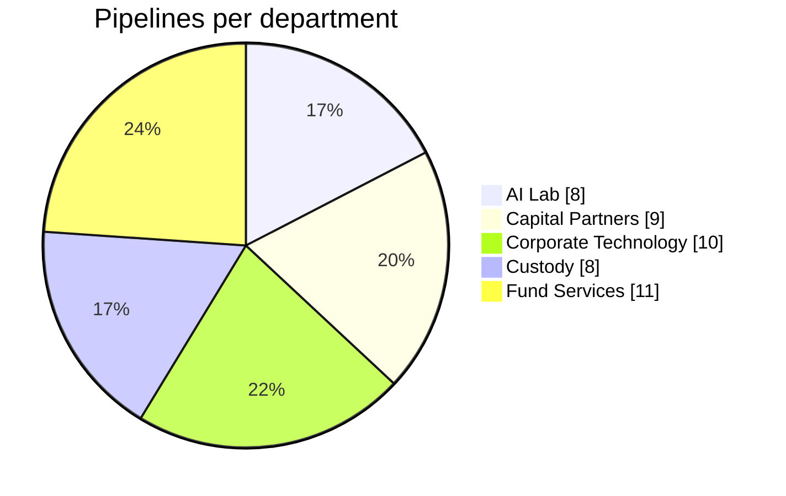
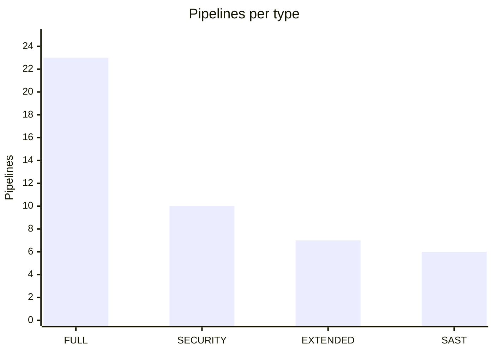
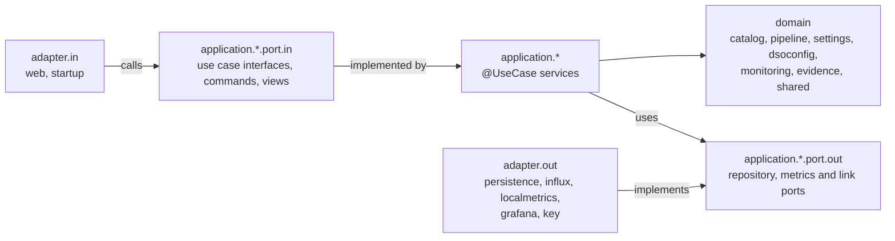
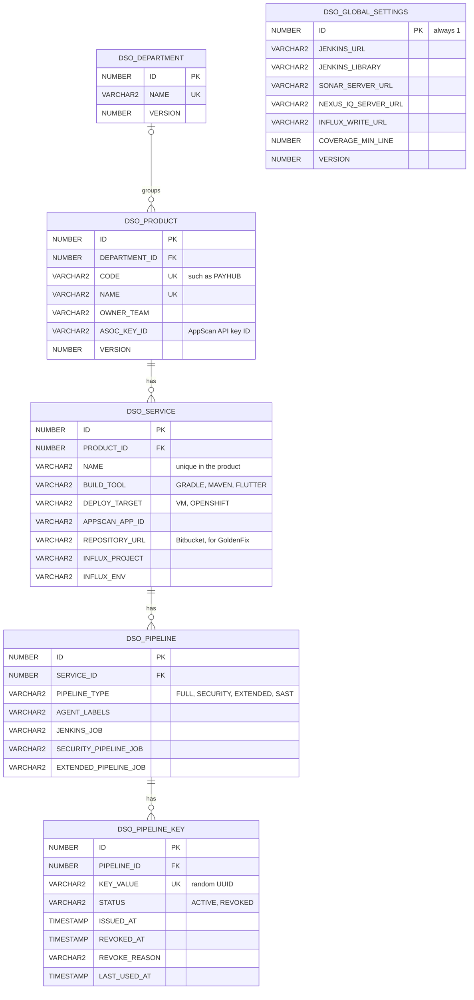

# BBH DevSecOps Management Portal

A web portal to onboard products to DevSecOps and to watch their pipelines. Its header has two menus: **Beadle**,
where new features land, and **DevSecOps Management**, with the four pages below.

- **Product Onboarding** (Beadle): a wizard for product managers who do not know DevSecOps. Five steps, each with at
  most three choices: pick the Static scan, Security or Full pipeline, then a new product or one already in the
  portal, then its services (name, AppScan application, Gradle or Maven, virtual machines or OpenShift), check and
  save. Every service gets a pipeline of the chosen type with its own key, and the last step lists what to do next
  in order, with the Jenkinsfile of each service ready to copy. Everything else comes from BBH defaults and the
  Global Settings, and can be fine-tuned in Product Management.
- **DevSecOps Product Management**: add a product with all of its services and every setting the DevSecOps library
  ([DSOEnhanced](https://github.com/mateuszmatan/DSOEnhanced)) reads from `config.yaml` today. Every new service
  gets a full pipeline with its own key; keys can be invalidated, regenerated and linked to a Jenkins job, and each
  service names the Bitbucket repository where DSOEnhanced raises its GoldenFix pull requests. Products live in
  departments, and each department shows how many DevSecOps pipelines it has for how many products. The five BBH
  departments (AI Lab, Capital Partners, Corporate Technology, Custody and Fund Services) come with the database; a
  product saved before departments existed shows as "Not in a department" until it is edited, which means choosing one.
- **DevSecOps Pipeline Monitoring**: every product with the status of its pipelines, and per pipeline its DORA
  metrics, daily activity, latest runs, the Jenkins job and your DSOEnhanced Grafana dashboard, all read from the
  InfluxDB the pipelines write to.
- **DevSecOps Change Evidence**: a read-only view of a product for ServiceNow change requests: per pipeline the
  unit, smoke, regression and performance tests, the SAST, DAST, SonarQube and Nexus IQ results, the release gate and
  the Jenkins build that produced them, with its artifact version and the portal configuration it ran with.
- **DevSecOps Global Settings**: the settings every pipeline shares and no service can override. They replace the
  library's `defaults.yaml`.

No `config.yaml` remains in the product repositories. The portal-integrated library reads each pipeline's
configuration from the portal by its key, so a service needs only the generic Jenkinsfile and its pipeline key:

```groovy
@Library('DevSecOpsJenkinsLibrary') _

devSecOpsPipeline(pipelineKey: '6f1c2d3e-0000-4abc-9def-123456789abc')
```

A run that builds several services of one product passes the keys of their pipelines of that type, the primary service
first; the product page offers this Jenkinsfile in the menu of a pipeline. Extended pipelines join only when they name
the same security pipeline, since the run reads the security run state of the primary's only:

```groovy
devSecOpsPipeline(pipelineKeys: ['6f1c2d3e-0000-4abc-9def-123456789abc', 'a1b2c3d4-0000-4abc-9def-123456789abc'])
```

During the cutover, pin the portal-integrated library version (for example `DevSecOpsJenkinsLibrary@DSOwithMgmtPortal`)
in the Global Settings' shared library (`platform.jenkinsLibrary`, the name the generated Jenkinsfiles load) and in
the `@Library` line of every migrated job, until every job carries a key.

## Running it locally

Needs Java 21. The Gradle wrapper downloads Gradle, and the build downloads its own Node.js for the GUI.

```bash
./gradlew :backend:bootJar
java -jar backend/build/libs/dso-portal-0.1.0-SNAPSHOT.jar
```

Open http://localhost:8080, or http://localhost:8080/beadle/onboarding for the onboarding wizard. Without a profile
the portal runs with `local`: an embedded H2 database in Oracle mode in `./data`, with demo products on the first
start. Every feature works on it. `./gradlew :backend:bootRun` does the same without building the jar (the database
then lives in `backend/data`).

To see metrics, point the portal at your InfluxDB and Grafana:

```bash
INFLUX_URL=https://influx.example.com INFLUX_TOKEN=... \
GRAFANA_DASHBOARD_URL=https://grafana.example.com/d/adzfc54123/devsecops-pipeline-long \
GRAFANA_SECURITY_DASHBOARD_URL=https://grafana.example.com/d/ad2trcm/devsecops-pipeline-security \
  java -jar backend/build/libs/dso-portal-0.1.0-SNAPSHOT.jar
```

The dashboards are the ones DSOEnhanced ships (`grafana/` in that repository); the portal opens them with the
service's `project` variable and the selected time range. Grafana must let portal users view them.

## Demo data

The `local` profile sets `dso.demo-data=true` (`DSO_DEMO_DATA`). On the first start it fills the H2 database in
`./data` with ten products in the five departments: 23 services and 46 pipelines, 44 of them with an active key. The
loader (`adapter/in/startup/DemoDataLoader.java`) adds the demo products that are missing and does nothing once the
database holds all of them or any product of its own; it also sets the Global Settings' Jenkins URL to
`https://jenkins.bbh.com` when none is set, so that job and build links work. `rd`, `qc` and `prod` (Oracle) get only
the five departments, from Liquibase, and the BBH default Global Settings; no product, service, pipeline or metric is
seeded there.

| Department | Product (code) | Services | Build and deploy | Pipelines |
|------------|----------------|----------|------------------|-----------|
| AI Lab | DocSense (`DOCSENSE`) | `extraction-api`<br>`review-ui` | Gradle, OpenShift<br>Gradle, VMs | FULL, SECURITY, EXTENDED<br>FULL, SAST |
| AI Lab | Advisor Assistant (`ADVISORAI`) | `assistant-api`<br>`content-indexer` | Maven, OpenShift<br>Gradle, OpenShift | FULL, SECURITY<br>FULL |
| Capital Partners | DealFlow (`DEALFLOW`) | `deals-web`<br>`deals-api` | Gradle, VMs<br>Maven, OpenShift | FULL<br>FULL, SECURITY, EXTENDED |
| Capital Partners | LP Portal (`LPPORTAL`) | `portal-web`<br>`statements`<br>`lp-mobile` | Gradle, OpenShift<br>Maven, OpenShift<br>Flutter | FULL<br>FULL, SAST<br>FULL, SAST |
| Corporate Technology | Access Hub (`ACCESSHUB`) | `requests-ui`<br>`workflow` | Gradle, VMs<br>Maven, OpenShift | FULL<br>FULL, SECURITY |
| Corporate Technology | CertScanner (`CERTSCANNER`) | `gui`<br>`backend-api` | Gradle, VMs<br>Maven, OpenShift | FULL, SECURITY, EXTENDED, SAST<br>FULL, SECURITY, EXTENDED |
| Custody | Safekeeping Ledger (`SAFEKEEP`) | `positions-api`<br>`recon-batch` | Maven, OpenShift<br>Gradle, VMs | FULL, SECURITY, EXTENDED<br>FULL, SAST (key revoked) |
| Custody | Corporate Actions (`CORPACT`) | `events-api`<br>`elections-ui` | Gradle, OpenShift<br>Gradle, VMs | FULL, SECURITY<br>FULL |
| Fund Services | Payments Hub (`PAYHUB`) | `gateway`<br>`ledger`<br>`notifications`<br>`mobile-app` | Maven, OpenShift<br>Gradle, VMs<br>Gradle, VMs<br>Flutter | FULL, SECURITY, EXTENDED<br>FULL<br>FULL<br>FULL, SAST (key revoked) |
| Fund Services | NAV Calculator (`NAVCALC`) | `pricing-engine`<br>`nav-api` | Maven, OpenShift<br>Gradle, OpenShift | FULL, SECURITY<br>FULL, EXTENDED |

Build and deploy: *Gradle, VMs* is a Gradle build deployed to virtual machines with UrbanCode Deploy and the SSH
deployment script; *Gradle, OpenShift* and *Maven, OpenShift* build with Gradle or Maven and deploy a container to the
RD and QC OpenShift projects; *Flutter* is a Flutter mobile app built as an APK. Every service has a full pipeline
plus the types listed after `FULL`. The keys of two SAST pipelines are revoked, so those pipelines show as disabled:
Payments Hub `mobile-app` ("Mobile app moved to the new mobile platform pipeline") and Safekeeping Ledger `recon-batch`
("Reconciliation moved to the mainframe scheduler"). Jenkins jobs are named `DevSecOps/<CODE>/<service>-<type>`, for
example `DevSecOps/PAYHUB/gateway-full`; CertScanner's full, security and extended pipelines share the jobs
`DevSecOps/CertScanner-pipeline`, `-security-pipeline` and `-extended-pipeline` and the metrics project `CertScanner`
for both services.





### Generated run history

With demo data on and `INFLUX_URL` empty, the portal reads its metrics from the table `DSO_METRIC_POINT` in H2
instead of InfluxDB (changeset `012-local-metrics`, `dbms:h2`, so the table never exists on Oracle). When that table
is empty at start-up, the portal records a random run history of the last 120 days for every pipeline, generated with
a fixed seed per pipeline, so monitoring, DORA metrics and change evidence show data out of the box and
`/api/monitoring/status` reports the metrics store as configured and reachable. Pipelines that share a metrics tag,
a type and a Jenkins job (CertScanner's two services) share one history, so 46 pipelines get 43 histories. The
history is recorded once and does not grow while the portal runs; delete `./data` (`backend/data` with `bootRun`) to
start over with a new catalogue and a history that ends at the new start.

| Type | Runs per day, on average | Duration | Stages |
|------|--------------------------|----------|--------|
| `FULL` | 1.4 | 45 to 95 minutes | Checkout, Build, Unit Tests, SonarQube, AppScan SAST, Nexus IQ, Publish Artifact, Deploy RD, Smoke Tests, Regression Tests, Deploy QC, Release Gate |
| `SECURITY` | 0.7 | 20 to 45 minutes | Checkout, Build, Unit Tests, AppScan SAST, Nexus IQ, SonarQube, AppScan DAST, Release Gate |
| `EXTENDED` | 0.4 | 70 to 130 minutes | Checkout, Read Security Run, Deploy RD, Smoke Tests, Regression Tests, Performance Tests, AppScan DAST, Deploy QC, Release Gate |
| `SAST` | 0.9 | 6 to 18 minutes | Checkout, Build, AppScan SAST, Release Gate |

- Runs start in working hours, 06:00 to 21:00 UTC. A run that would start on a Saturday or Sunday moves to Monday
  four times out of five, so most runs fall on weekdays.
- Each pipeline gets a health between 75% and 97%, the chance that a run succeeds. After a failed run the next one
  succeeds only 45% of the time, so failures tend to repeat. A run that does not succeed fails (half of them), is
  unstable with one warning check (four in ten) or is aborted (one in ten).
- Runs build `develop` (55%), `main` (15%), a `feature/` branch (22%) or a `release/` branch (8%). A run is a
  deployment when it reached Deploy RD on a branch other than `feature/`, so only full and extended pipelines deploy;
  a deployment whose run failed is a change failure. Each pipeline has its own typical lead time of 2 to 47 hours.
- Every run writes `pipeline_run` and `dora` points. The last two runs of each pipeline also carry the full evidence:
  `stage_event` per stage; per service `build_evidence`, and `test_execution`, `code_coverage` and
  `security_findings` for the stages the run reached; and `policy_status`, `vulnerabilities` and `release_gate`.
- The history of a pipeline whose key is revoked ends nine days before the first start.

## Profiles and configuration

| Profile | Where | Database |
|---------|-------|----------|
| `local` (default) | a developer's machine | embedded H2 in `./data`, demo data |
| `rd` | the lower test environment | Oracle |
| `qc` | UAT | Oracle |
| `prod` | production | Oracle |

| Variable | Default | Meaning |
|----------|---------|---------|
| `DB_URL`, `DB_USERNAME`, `DB_PASSWORD` | H2 with `local`; required with `rd`, `qc`, `prod` | database of the active profile |
| `DB_POOL_SIZE` | 5, 10, 20 in `rd`, `qc`, `prod` | Oracle connection pool size |
| `PORT` | `8080` | HTTP port |
| `INFLUX_URL`, `INFLUX_TOKEN` | empty | your InfluxDB; empty switches the monitoring off, except with demo data, which then reads the local metrics store (see [Demo data](#demo-data)) |
| `INFLUX_ORG`, `INFLUX_BUCKET` | `DevSecOps`, `DORA-metrics` | where DSOEnhanced writes its metrics |
| `GRAFANA_DASHBOARD_URL` | empty | link to the DSOEnhanced pipeline dashboard; empty hides the dashboard |
| `GRAFANA_SECURITY_DASHBOARD_URL` | empty | link to the security dashboard for `SECURITY` and `SAST` pipelines; empty uses the pipeline dashboard |
| `DSO_DEMO_DATA` | `true` with `local` | create the demo products when the database holds no other product, and without `INFLUX_URL` a run history; see [Demo data](#demo-data) |

```bash
SPRING_PROFILES_ACTIVE=qc DB_URL=jdbc:oracle:thin:@//<host>:1521/<service> DB_USERNAME=DSO_PORTAL DB_PASSWORD=... \
  java -jar backend/build/libs/dso-portal-0.1.0-SNAPSHOT.jar
```

Liquibase creates and updates the schema at start-up, on Oracle and on H2. The BBH tool servers and everything else
pipelines share are stored in the database and edited in the Global Settings tab. Secrets never reach the portal:
services name Jenkins credentials IDs, and the generated configuration carries only those IDs.

## OpenShift

The portal ships as one container image (UBI 9 with Java 21, any non-root UID). `Dockerfile` and the Kustomize
manifests for `rd`, `qc` and `prod` are described in [deploy/openshift/README.md](deploy/openshift/README.md).

## Architecture

```
gui/        Angular 22 + Angular Material: views, shared components, API services
backend/    Spring Boot 4.1, Java 21, Spring Data JPA, Liquibase; serves the API and the built GUI
deploy/     the OpenShift manifests
examples/   Jenkinsfiles, API calls, a rendered configuration and GUI screenshots; see Examples below
```

The portal is one Spring Boot jar that serves the API and the built Angular GUI. Jenkins jobs never reach its
database: the DSOEnhanced library asks the portal for each pipeline's configuration by key, writes its run metrics to
InfluxDB, and raises its GoldenFix pull requests in the service's Bitbucket repository. The portal reads those metrics
back for the monitoring and change evidence pages and links the DSOEnhanced Grafana dashboards.


The backend (`backend/src/main/java/com/bbh/itss/dso/portal`) is hexagonal:

| Package | Holds |
|---------|-------|
| `domain` | plain Java: products, services and their settings, pipelines and keys, the global settings, the rendered configuration, DORA metrics and change evidence; every business rule lives here |
| `application` | the use cases behind ports, per area (`catalog`, `dsoconfig`, `evidence`, `monitoring`, `pipeline`, `settings`), each with its `port.in` and `port.out` packages; `@UseCase` classes become transactional beans, without Spring in the code |
| `adapter.in` | Spring MVC controllers with the request and response records (`web`), and the start-up tasks (`startup`) |
| `adapter.out` | JPA entities and Spring Data repositories (`persistence`), the InfluxDB client (`influx`), the Grafana links (`grafana`), the local metrics store of the demo data (`localmetrics`) and the key generator (`key`) |
| `config` | the wiring of use cases and transactions |



ArchUnit tests keep the domain and the use cases free of Spring, JPA and Jackson, and keep the adapters apart: the
domain depends only on the JDK, the application only on the domain, `adapter.in` never on `adapter.out` or a
`port.out`, `adapter.out` never on `adapter.in`, and every `@UseCase` class implements a `port.in` interface. The
key generator's port, `KeyGenerator`, lives in `domain.pipeline`.

### Data model

Liquibase creates the tables from `backend/src/main/resources/db/changelog/oracle`, one SQL file per change; most
changesets run on Oracle and on H2, a few on one of them only. The main tables and a few of their columns:



A service has at most one pipeline of each type, and a pipeline at most one `ACTIVE` key; revoked keys stay as its
key history. `DEPARTMENT_ID` is empty only for a product saved before departments existed. The service settings that
repeat live in child tables of `DSO_SERVICE` (`DSO_SERVICE_TEST_JOB`, `DSO_SERVICE_SSH_TARGET`,
`DSO_SERVICE_OPENSHIFT_TARGET`, `DSO_UCD_APPLICATION` with `DSO_UCD_COMPONENT`, `DSO_SERVICE_NEXUS_IQ_APP`), and the
scanners' severity limits in `DSO_GLOBAL_SEVERITY_LIMIT`. `DSO_METRIC_POINT` exists on H2 only; see
[Demo data](#demo-data).

## DevSecOps integration

| Request | Answer |
|---------|--------|
| `GET /api/dso/config/{key}` | 200 with the pipeline's `config.yaml` (`?format=json` for JSON), recording the key's last use; 403 with the reason once the key is invalidated; 404 for a key never issued |
| `GET /api/pipelines/{id}/config` | the same configuration for the portal UI, without recording a use |
| `GET /api/products/{id}/config` | every service of a product as one `config.yaml` |
| `GET /api/settings/config` | the part of every configuration that comes from the global settings |

Every key the library reads per service is a setting of the service. A service may name its own Nexus IQ server and
credentials, SonarQube server, InfluxDB write URL and credentials, and AppScan secret (a Secret text credentials ID);
left empty, the configuration carries the global setting or, for the AppScan secret, the product's. One Nexus IQ
application is written as `tools.nexusIq.application: <name>`; several are written as a map of applications, each
entry with its scan patterns, stage and the effective server and credentials.

### How the library reads its configuration

The library reads each pipeline's configuration from this portal over HTTPS, with one
`GET /api/dso/config/<key>?format=json` per key, sent with `curl` from a Jenkins agent before the pipeline starts.
The portal renders the configuration from its database at that moment and records the key's last use. Jenkins needs
only the portal's address, the global environment variable `DSO_PORTAL_URL` (for example
`https://dso-portal.apps.bbh.com`); it holds no database account, no credentials and no driver, and only the portal
reaches its database.


The key is the only check. Whoever holds a key reads the configuration of that one pipeline, which names Jenkins
credentials IDs and no passwords, much as anyone who could read a product repository could read its `config.yaml`.
Keys are random UUIDs, the API lists none of them by this request, and an invalidated key is refused with 403 at once.
When the portal moves behind BBH SSO, `/api/dso/config/**` stays outside the sign-in.

A pipeline's metrics are matched by the InfluxDB tags the library writes: `project` (the service's metrics project
plus the pipeline type suffix: none for full, `security`, `extended`, `sast`) and `env`.

Several services may share one metrics project and env. Under a shared tag a `pipeline_run` belongs to the pipeline
whose Jenkins job (or a branch of it) recorded it in the `job` field; a pipeline without a Jenkins job shows no run,
and a run of one job building several services belongs to each of them. DORA metrics and the Grafana dashboard stay
per tag. Concurrent runs under one tag can still mix the points the library writes without a `module` tag.

### Change evidence

The Change Evidence page reads the points of a pipeline's latest run, per service (`module` tag):

- `test_execution` with `suite=unit` gives the unit test row (total, passed, failed, skipped, duration); the smoke,
  regression and performance rows come from the suites the remote test jobs record, and the status of the stage that
  ran a suite wins over its counts;
- `build_evidence` gives the artifact version, the SonarQube quality gate (`OK`, `WARN`, `ERROR`; `NONE` reads as not
  recorded), the SAST, DAST, Nexus IQ and SonarQube report links, and when the portal rendered the configuration the
  build read with its sha256 hint;
- `security_findings`, `policy_status`, `vulnerabilities`, `code_coverage`, `release_gate` and `stage_event` give the
  scans, coverage, release gate and stages as before.

A SonarQube policy status wins over the quality gate. A run without `build_evidence` (a library older than the
portal integration) keeps the links the portal builds: the HCL AppScan scans of the application, the SonarQube
dashboard of the project and the Nexus IQ server, and the Jenkins build pages. A point without a `module` tag (an
older library) counts for the service only when it is the run's only point of its kind; a point of another module
never does.

## Accepted differences from config.yaml

Moving the configuration into the portal changes these behaviours of the library on purpose:

1. Configuration lives in the portal, not in the repository: no per-branch, per-PR or per-commit configuration; a
   replay of an old build uses today's portal values; release and develop jobs of one service share one pipeline per
   type. The console, the report header and `build_evidence` record the key hint, `renderedAt` and the sha256 hint.
2. Failures before `pipeline {}` leave no report, `release-gate.json` or InfluxDB point; `build_duration` and the DORA
   duration include the bootstrap read.
3. The archived run-state file is `pipeline-config.yaml`, not `config.yaml`; the first extended run after cutover needs
   one security build made by the new library.
4. The extended pipeline uses its own key's projects plus the security run's run-time tags, not the security run's
   whole `config.yaml` copy.
5. Keys the portal does not model are gone from `getCFG()` (custom keys a team added to `config.yaml`);
   `tests.<suite>.defaults`, bare-string test jobs and `urls` are expanded by migration into jobs; `jobs[].auth` maps
   other than credentials IDs, OpenShift `appName`/`imageNamespace`/`cluster`/`credentialsId` (only the unused
   nexusDelivery API reads them) and the keys the library no longer reads are not modelled.
6. Selecting projects through `PROJECT_NAMES`/`PROJECT_NAME` without keys is gone; the keys decide.
7. Texts that named `config.yaml`/`defaults.yaml` now name the portal, also where they reach the report,
   `release-gate.json` and InfluxDB. A Jenkinsfile `securityPipeline` in a full, security or SAST pipeline is ignored,
   which shows the Nexus IQ and SonarQube summary rows it used to hide.
8. Nexus IQ report links appear for every service, because the IQ server URL is global (GoldenFix stays governed by
   its own per-service switch).
9. Every build depends on the portal at start; the agents of the `DSO_PORTAL_AGENT` label need HTTPS access to it.

## Preconditions before wider use

This change does not bring BBH single sign-on with roles, an audit trail of who changed what, or a history of the
rendered configuration; the owner decides on them later. Until they exist the portal must not be
reachable outside the test network, because a portal edit now steers every build and pipeline keys are bearer
secrets.

## REST API

| Method and path | Purpose |
|-----------------|---------|
| `GET /api/departments` | departments by name, each with the number of its products, their services, their DevSecOps pipelines and the pipelines with an active key |
| `POST /api/departments`, `PUT`/`DELETE /api/departments/{id}` | add, rename or delete a department; `PUT` carries the `version` it was read at; a department that still has products is not deleted (409) |
| `GET /api/products?search=` | products with their department, service and pipeline counts; the search also matches the department name |
| `POST /api/products`, `GET`/`PUT`/`DELETE /api/products/{id}` | a product in its department (`departmentId`, required on every save) with its complete list of services; `PUT` carries the `version` it was read at; every service the save creates gets a full pipeline with an active key, or with `?pipelineType=SAST\|SECURITY\|FULL` every service of the product without a pipeline of that type gets one |
| `GET /api/products/code-suggestion?name=` | the code the portal suggests for a new product's name: its letters and digits in upper case, with a number added when another product has that code |
| `GET /api/products/{id}/pipelines` | each service of a product with its pipelines |
| `POST /api/services/{id}/pipelines` | add a pipeline; it starts with an active key |
| `GET`/`PUT`/`DELETE /api/pipelines/{id}` | a pipeline with its key history |
| `POST /api/pipelines/{id}/keys` | issue a new key; an active key is invalidated with the reason "Replaced by a new key"; on a pipeline whose key was invalidated this is Regenerate, and the old keys stay refused |
| `POST /api/pipelines/{id}/keys/revoke` | invalidate the active key, with a `reason` of at most 500 characters; 409 when the pipeline has no active key |
| `GET /api/dso/config/{key}`, `GET /api/pipelines/{id}/config`, `GET /api/products/{id}/config`, `GET /api/settings/config` | the DSOEnhanced configuration as YAML, or as JSON with `?format=json`; see [DevSecOps integration](#devsecops-integration) |
| `GET /api/monitoring/status`, `/products`, `/products/{id}`, `/pipelines/{id}?range=30d` | monitoring data |
| `GET /api/monitoring/activity?range=30d` | the DORA summary and the daily activity of all pipelines together, as `{pipelines, dora, metricsError}`: the number of pipelines, the DORA metrics over the range with `dora.daily` (runs, failures and deployments per day), and the metrics error, if any |
| `GET /api/evidence/products/{id}` | the change evidence of a product's pipelines |
| `GET`/`PUT /api/settings` | the global settings; `PUT` carries the `version` it was read at |

A `range` is a number of days from `1d` to `730d`, `30d` when left out. Errors are RFC 9457 problem details;
validation errors name the failing fields, for example `services[2].build.javaPath`. Key values are only sent by the
product management endpoints, and only for the active key; everywhere else a key shows as its hint.

## Examples

[examples/README.md](examples/README.md) describes the Jenkinsfiles of each pipeline type and of a run that builds
several services, `curl` scripts for the REST API, the configuration the library receives for the demo service
Payments Hub `gateway`, and the screenshots of the GUI per version.

## Tests

```bash
./gradlew check
```

builds everything and runs every suite of both modules:

| Module | Suite | What |
|--------|-------|------|
| backend | unit (`src/test`) | domain rules, use cases, adapters and the architecture rules; JaCoCo fails below 60% line coverage (`-Pcoverage.minimum=`) |
| backend | regression (`src/regressionTest`) | the API end to end on H2 in Oracle mode, with the pinned configuration contract (`-Dregression.updateExpected=true` rewrites the expected files) |
| backend | smoke (`src/smokeTest`) | starts the portal and checks health, the API and the UI; `-Dsmoke.baseUrl=https://...` checks a deployed portal |
| backend | performance (`src/performanceTest`) | p95 latencies of the main calls on 25 products x 16 services |
| gui | unit (Vitest) | components and form models; fails below 60% of lines and statements |
| gui | smoke, regression, performance | Spock and Playwright in Chromium against a stub API: every page, the user journeys with the requests they send, and page timings on a large catalogue |

`-Dperformance.factor=2` relaxes the performance limits on a slow machine. Run one suite with, for example,
`./gradlew :backend:regressionTest` or `./gradlew :gui:smokeTest`; [gui/README.md](gui/README.md) covers the GUI in
detail, including its development server.

## Known gaps

- The portal has no sign-in yet; see the preconditions above.
- The change evidence of runs made by a library older than the portal integration has no unit test counts, artifact
  version, SonarQube quality gate, report links or configuration hint, so its links are built from the global settings
  and the Jenkins build number.
